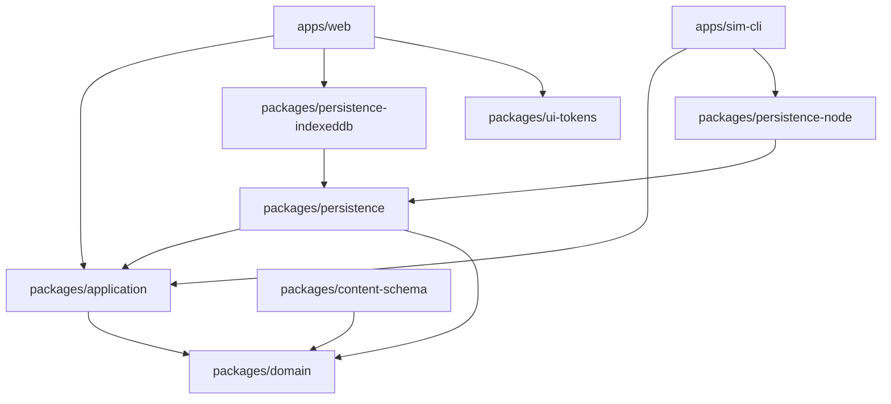

# Architecture

## Dependency direction



`packages/domain` is the innermost package. It has no DOM, React, IndexedDB, Node, persistence-adapter, network, or model dependency.

## State-change path

```text
Web / CLI / future Agent
  -> Command schema
  -> Application preconditions
  -> cloned state + cloned RNG streams
  -> pure domain operation
  -> state and invariant validation
  -> atomic session commit
  -> save/report/presenter
```

A failed command leaves the original state, revision, command log, and RNG stream counters unchanged.

The batch simulator has a separate, explicitly throwaway adapter. It validates the same command
envelope and calls the same domain resolver, but commits in-place and validates at school-year
checkpoints to make 1,000+ runs practical. Any thrown batch run is discarded in full; it is never
used for player saves or persistent sessions.

## Determinism boundary

Replay identity is:

```text
engineVersion
+ contentPackHashes
+ saveSchemaVersion
+ rootSeed
+ RNG stream states
+ snapshotHash
+ ordered accepted commands
```

Audit timestamps are excluded from rules calculations. Cosmetic RNG is isolated from training, match, recruitment, events, injury, and career outcomes.

## Persistence

- `packages/persistence` defines the save envelope, integrity checks, repository contract, and in-memory atomic adapter.
- `packages/persistence-node` writes a temporary file, verifies it, rotates the previous good save to a backup, then renames the temporary file.
- `packages/persistence-indexeddb` updates the latest and backup snapshots in one IndexedDB transaction.
- Browser or file storage is never the only conceptual source of truth; export/import remains a later application concern.

## P01 time model

- 3 school years.
- 2 terms per school year.
- 20 calendar weeks per term.
- Weeks 1–16 are `TERM_OPERATION`.
- Weeks 17–20 are `EXAM_WRAP`.
- Total: 120 calendar weeks and 96 operation weeks.
- P01 uses a fixed initial fixture and does not freeze formal annual recruitment.
