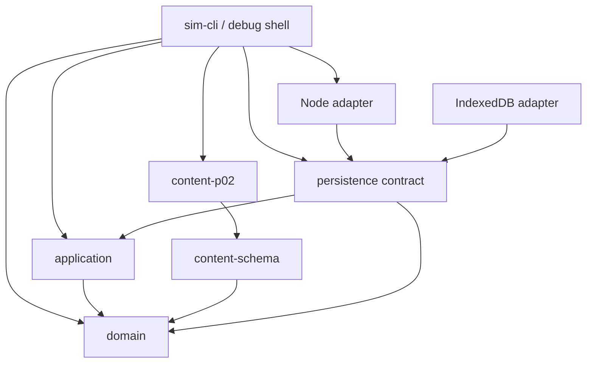

# P02 开发方案

- 项目：Sunny Court Manager / 篮球经理 LLM
- 文档版本：v1.2 Approved
- 文档状态：`OWNER_APPROVED`
- 编制日期：2026-08-01
- Owner 批准日期：2026-08-01；12 人球队修订：2026-08-02
- 权威玩法输入：`docs/P02_GAMEPLAY_BASELINE.md` v1.2
- 编制依据仓库文档基线：`main@2bdb373dfa7cf690be36a87871d447f4ebe7daf4`
- 冻结 P00/P01 代码基线：`6547fbf51b2a440fd9602eed82c869d70b1181e1`
- 当前 P01 引擎版本：`0.1.2-p01-r2`
- 批准时实现状态：P01-M1/P02 代码尚未开始

---

## 0. 文档用途与批准边界

本文回答“已经批准的 P02 玩法怎样安全、可审计地落到当前 TypeScript 仓库”，包括：

- 现有代码的复用、隔离和替换范围；
- 目标模块、数据合同、命令边界和持久化边界；
- P01-M1 与 P02 各切片的依赖、文件范围、验收和 Gate；
- Legacy P01、GameState V2、MatchSession、整周事务和局部 RNG 的演进方式；
- 测试、性能、证据、PR、独立审核和回滚规则。

本文不重新设计玩法。出现冲突时，优先级固定为：

1. `docs/P02_GAMEPLAY_BASELINE.md`；
2. 已接受的 P00/P01 工程不变量；
3. 本开发方案；
4. 实现便利。

只有前两项的新版本或 Owner 明确决定，才能修改玩法结构。标记为 `[CALIBRATE]` 的数值可以通过预注册场景调整；不能以调参名义引入卡牌、29 属性、组合默契、伤病、士气、专注、压力、完整赛事、招募、生产 UI、LLM 或 Agent。

本方案已获 Owner 批准。该批准授权按第 9 章的 Issue 依赖顺序从 P01-M1 开始实现；它不等于任何实现 PR、独立 Gate 或后续阶段自动通过。

## 0.1 执行结论

采用以下主线：

```text
P02-000 正式玩法基线
  → P01-M1 年度拨款完整性加固
  → P02-001 架构 ADR 与开发脚手架
  → P02-002 MatchSession 合同与键控 RNG
  → P02-003 Headless Model B
  → P02-004 GameState/Save V2 与规则内容
  → P02-005 训练、成长和周计划
  → P02-006 名单、职责、战术和轮换
  → P02-007 周赛槽与三类比赛
  → P02-008A 原子整周闭环、Save V2 与完整重放
  → P02-008B 默认根入口与 CLI 切换
  → P02-009 节间/死球临场命令
  → P02-010 事实反馈、投影与档案读取
  → P02-011 P02 Gate 与独立审核
```

保留 P02-001～011 共 11 个编号，其中 P02-008 拆为 A/B，因此形成 12 个可独立合并单元：P02-001～007、P02-008A、P02-008B、P02-009～011。State V2、训练、三类比赛、整周事务和反馈不得集中到少数大 PR。每个合并点必须保持 `pnpm check` 通过，不允许仓库处于“根导出已切 V2、应用或持久化仍是 V1”的半迁移状态。

## 0.2 四个高风险 Gate

| Gate | 对象                                  | 必须独立复核的原因                                     |
| ---- | ------------------------------------- | ------------------------------------------------------ |
| M1   | P01 年度拨款完整性                    | 直接改变存档接受边界，且要保留 R1/R2 历史              |
| B    | P02-003 Match Model B                 | 决定确定性、篮球统计和性能基础                         |
| C    | P02-008A 功能闭环 + P02-008B 生产切换 | 先证明全局事务、存档和生命周期，再以独立回滚单元切入口 |
| D    | P02-011 P02 总 Gate                   | 决定 P02 是否完成及能否进入后续阶段                    |

其余切片仍需 CI、范围检查和实现自测，但实现线程自测不能冒充上述独立审核。

## 0.3 条件审核补项与批准结论

Owner 接受 2026-08-01 条件审核提出的四项阻断补项，并以本 v1.1 关闭条件状态：

1. Save V2 的 snapshot、权威 RNG 与有限 audit tail 建立连续的 revision/hash 身份链，并加入三者交换后重算外层 checksum 的攻击测试；
2. 在 P02-002 冻结确定性 match/event/fact/transcript 身份；
3. 在 P02-009 建立 8 个固定场景的 FULL_COACH 生产链矩阵，并在 P02-011 总 Gate 重跑；
4. P02-008 拆为功能闭环 008A 和默认入口切换 008B，分别可构建、可回滚，合计通过 Gate C。

同时采纳两项开发方案修订：V2 只持久化有权威消费方的 `match` RNG；cosmetic 随机保持非权威或无状态派生。以上内容不改变 `docs/P02_GAMEPLAY_BASELINE.md` 的周循环、比赛、轮换、数值或延期边界。

## 0.4 v1.2 球队人数修订

Owner 于 2026-08-02 将 P02 从“约 22 名活跃球员中登记 12 人参赛”改为“整支球队固定
12 名活跃球员，正式赛和友谊赛登记全队”。本修订具有以下实现约束：

- P02 固定内容夹具为 12 名高一球员，三年 P02 循环中保持 12 人并在终局统一毕业；
- `registeredRosterIds` 仍保存稳定顺序，但其集合必须与 12 名活跃球员完全相等；
- `SET_MATCH_SETUP` 只调整登记顺序、首发、职责、战术和轮换，不提供排除队员的名单选择；
- 队内赛将 12 人确定性分成 6 对 6；
- 招募、混合年级、毕业空位补充和少于 12 人时的可持续规则仍属于 P03；
- Legacy P01 的 22 人夹具、冻结 hash、存档和证据原样保留，只作为回归基线。

---

# 1. 当前仓库事实

## 1.1 已冻结、直接复用

| 现有能力                                                | 当前位置                                | P02 处理                                            |
| ------------------------------------------------------- | --------------------------------------- | --------------------------------------------------- |
| pnpm workspace、严格 TypeScript、Vitest、构建和边界检查 | 根配置、`scripts/check-boundaries.mjs`  | 原样保留                                            |
| 纯领域依赖方向                                          | `packages/domain`                       | 原样保留；不得引入 DOM、React、Node、存储或模型 SDK |
| 克隆 state/RNG 后校验并一次提交                         | `packages/application`                  | 作为全局事务原型保留并扩展                          |
| 根 seed、隔离 RNG 流和调用计数                          | `packages/domain/src/rng.ts`            | 全局流继续使用；比赛内部另加无状态键控随机          |
| 稳定序列化和状态 hash                                   | `packages/domain/src/hash.ts`           | 保留；V2 增加内容和 transcript 身份                 |
| Save envelope、latest/backup、Node/IndexedDB 原子写     | `packages/persistence*`                 | 适配 V2；不改变“坏存档不得覆盖唯一好存档”           |
| 120/96/24 周时间边界                                    | `packages/domain/src/time.ts`、P01 测试 | 语义保留，玩法结算重写                              |
| 40/80/120 年度拨款时点                                  | P01-R2                                  | 保留，并由 M1 补齐存在性、金额和余额链              |
| P01 golden/replay/25 项测试                             | tests/evidence                          | 作为 Legacy P01 回归保留，不作为 P02 平衡证据       |

## 1.2 必须替换的占位实现

| 当前占位                                   | 不能继续沿用的原因                     | 替代                             |
| ------------------------------------------ | -------------------------------------- | -------------------------------- |
| 四项 `offense/defense/athleticism/stamina` | 不符合获批 10 能力模型                 | GameState V2 球员能力            |
| 士气、专注、压力和伤病状态                 | P02 无来源、决策或反馈闭环             | V2 不含这些字段                  |
| `SET_TRAINING_PLAN` + `ADVANCE_WEEK`       | 一个命令隐式包办训练、扣费、比赛和推进 | 保存周计划 + 原子完成运营/考试周 |
| Model A 总评前 12 + 终场分配得分           | 不能支持位置、职责、战术或事实统计     | Model B 增量球权链               |
| 每四运营周才比赛                           | 已批准每个运营周一个比赛槽             | 正式赛优先，否则队内/友谊        |
| 所有比赛共用胜负和生涯                     | 会污染正式记录                         | `matchKind + recordScope` 分类   |
| 每周固定运营费、考试维护费                 | 已被最小资源闭环删除                   | 只提交主动支出和年度拨款         |
| 三维声誉                                   | P02 只需要单一球队声誉                 | 单一整数值                       |
| 当前 Web 壳                                | P02 不做生产 UI                        | 仅保持可构建，不接 P02 交互      |

## 1.3 当前技术缺口

- `schemas.ts`、`time.ts` 和 `application/index.ts` 已过度集中，P02 不继续堆入单文件。
- 当前 Save Schema 只接受字面量 `0.1.0 / 0.1.2-p01-r2`，尚无 V2 或明确的旧版本错误。
- 当前 `DeterministicRng` 是顺序流；它不足以保证某分支少抽一次时其他 `drawKind` 不错位。
- 当前 GameSession 只有全局提交，没有可中止的 OperationWeekSession/MatchSession。
- 当前审计尾只记录全局 DomainEvent；比赛数百个球权不能直接塞进该尾部。
- 当前证据清单脚本只硬编码 P00/P01，不能安全生成独立的 P01-M1/P02 manifest。
- 当前 Legacy P01 初始夹具 18 名高一、4 名高二可支撑历史回归，但包含 2★、旧字段和已撤销的 22 人规模，不能当 P02 正式夹具。

---

# 2. 目标架构

## 2.1 依赖方向



约束：

- `domain` 只接受已经验证的规则输入，不加载文件、数据库或 UI 状态；
- `content-schema` 可依赖领域公共 DTO/枚举，`content-p02` 只依赖 `content-schema`；领域和 application 不得反向依赖具体内容包；
- CLI 装配并验证 `content-p02` 后，把领域定义的 RulesContext DTO 传给 application；application 不读取内容文件；
- CLI 可以依赖 domain 的只读 DTO/hash 和 persistence contract，但不得直接调用任何状态变更 resolver；生产状态变更只经 application；
- `application` 负责全局命令、临时整周会话、expectedRevision/CAS 和最终提交；
- `persistence` 只保存已提交 GameState/SaveEnvelope，不持有正在进行的比赛事务；
- P02 不改 Web 生产状态架构，临场验证通过 CLI/debug shell 完成。

## 2.2 目标目录

```text
packages/domain/src/
  core/
    fixed-point.ts
    rng-contract.ts
    rng.ts
    legacy-stable-hash.ts
    canonical-v2.ts
  legacy-p01/
    constants.ts
    schemas.ts
    create-game.ts
    model-a.ts
    time.ts
    index.ts
  game/
    schemas/
      player.ts
      calendar.ts
      finance.ts
      records.ts
      rng-v2.ts
      game-state-v2.ts
    create-game-v2.ts
    training.ts
    roster.ts
    tactics.ts
    schedule.ts
    lifecycle.ts
    settlement.ts
    invariants.ts
  match/
    schemas.ts
    keyed-rng.ts
    effects.ts
    probabilities.ts
    lineup.ts
    rotation.ts
    opponent-policy.ts
    session.ts
    step.ts
    finalize.ts
    replay.ts
    result.ts
    invariants.ts

packages/application/src/
  legacy-p01.ts
  commands-v2.ts
  game-session-v2.ts
  operation-week-session.ts
  match-command-session.ts
  replay-bundle-v2.ts
  audit-v2.ts
  index.ts

packages/persistence/src/
  legacy-p01.ts
  envelope-v2.ts
  repository.ts
  index.ts

packages/persistence-node/src/
  legacy-p01.ts
  repository-v2.ts
  index.ts

packages/persistence-indexeddb/src/
  legacy-p01.ts
  repository-v2.ts
  index.ts

packages/content-schema/src/p02/
  schemas.ts

packages/content-p02/src/
  manifest.ts
  rules.ts
  players.ts
  opponents.ts
  index.ts

apps/sim-cli/src/
  p02-match-runner.ts
  p02-three-year-runner.ts
  p02-replay-runner.ts
  p02-debug-match.ts

apps/sim-cli/src/legacy-p01/
  runner.ts

tests/
  p01-legacy-regression.test.ts
  p02-match-invariants.test.ts
  p02-operation-week.test.ts
  p02-three-year.test.ts
  p02-directional-scenarios.test.ts
```

这是职责布局，不要求一次重命名所有旧文件。P02-001 先以纯机械方式建立 Legacy 子路径和原路径兼容层；P02-002～008A 再按依赖线，以显式 V2/Match 导出和 V1 生产路径并存的方式逐步开发。P02-008B 只在 008A 功能闭环验收后，以独立可构建、可回滚的切片完成默认根导出、应用入口、持久化和 CLI 的 V2 切换。

`game/roster.ts` 只拥有持久默认名单、推荐、setup 合法性和 MatchInput 构建；`match/lineup.ts` 只拥有比赛内五槽、资格、换人和强制补位。两者使用同一份稳定候选排序原语，不得各自实现一套 tie-break。

## 2.3 两层会话

| 层                     | 权威范围                                           | 是否写 GameState | 是否持久化 |
| ---------------------- | -------------------------------------------------- | ---------------: | ---------: |
| `GameSessionV2`        | 已提交全局状态、全局 RNG、revision、审计尾         |               是 |         是 |
| `OperationWeekSession` | 从某一全局 revision 克隆出的整周工作副本           |   否，完成前不写 |     P02 否 |
| `MatchSession`         | 本周工作副本中的比赛 Anchor、局部 seed、transcript |               否 |     P02 否 |

`OperationWeekSession` 不能持有 Node 文件锁、IndexedDB transaction 或数据库连接。它只持有内存对象和来源身份：

- `sourceRevision`；
- `sourceStateHash`；
- `sourceRngHash`；
- `weekPlanHash`；
- 正式/友谊赛的 `matchSetupHash`，或队内赛的 `scrimmageGroupingInputHash`；
- 本场 `controlStrategy`；
- `contentPackHashes`。

最终提交时 `GameSessionV2` 再比较 expectedRevision 和上述身份；任一不一致返回 `OPERATION_SESSION_STALE`，全局状态保持不变。

创建 `OperationWeekSession` 本身就是对当前计划和有效比赛输入的一次确认。是否可以创建该会话由当前计划、对应比赛类型所需的 setup/分组输入、预算和规则内容即时派生；GameState 不持久化独立的 `confirmed` boolean。

## 2.4 一次整周提交

```text
全局已保存计划
  → 克隆 state + RNG
  → 结算训练/恢复/活动
  → 固定消耗一次全局 match seed
  → 在局部 MatchSession 完成比赛
  → 结算分类记录、成长、疲劳、经费、声誉、里程碑
  → 标记当前周已完成
  → 年末时按年级快照执行升年级/毕业与档案，再计完成学年并拨款
  → 第三年置终局；否则才建立下一周并应用“进入周”的自然恢复
  → V2 Schema + 跨实体不变量验证
  → revision + 1、全局事件和审计
  → 一次替换 GameSessionV2 的 state/RNG
```

完整执教退出、进程异常、watchdog、session 损坏、最终 CAS 冲突或全局校验失败，都丢弃整份工作副本。P02 不支持比赛中途保存或恢复；退出回到赛前已保存计划。中途保存由未来阶段另立设计，不允许实现线程擅自序列化半场状态。

---

# 3. 版本、精度和 Legacy 策略

## 3.1 V2 版本身份

P02-004 建立以下版本常量，P02-008B 切为生产默认：

| 身份              | P02 目标值       |
| ----------------- | ---------------- |
| Engine            | `0.2.0-p02`      |
| Save Schema       | `0.2.0`          |
| Match rules       | `model-b-p02-v1` |
| Content namespace | `p02-fixture`    |
| Content version   | `0.1.0`          |

若 P02 实现期在首次 Gate 前出现不兼容合同修改，提升 Match rules/content 版本；已经写出的测试 fixture 必须显式更新，不能让同一版本代表两种规则。

SaveEnvelope V2 必须精确校验预期内容 hash 集合；不能继续接受任意 `Record<string,string>` 后只计算 checksum。影响能力、倾向、特质、训练表、对手模板和规则参数的内容全部纳入 hash；纯立绘、动画、音频和界面文案不进入比赛 hash。

`CommandAuditRecordV2` 不保存墙钟 `auditedAt`。权威审计时间只由 revision、command-local sequence 和当时的游戏日历身份构成；可选的运行时墙钟只允许进入非持久 telemetry/log，不进入 GameState、Save、canonical audit hash 或 ReplayBundle。Legacy P01 的可注入 audit clock 行为保持不变。这样不同现实时间重放时，V2 audit/state/RNG hash 仍必须一致。

## 3.2 Legacy P01 隔离

最终状态必须满足：

- P01 Schema、Model A、create-game、time resolver、application session 和 save envelope 只通过 `legacy-p01` 显式入口访问；
- P02 根导出的 `GameStateSchema`、`GameSession` 和 `SaveEnvelopeSchema` 只表示 V2；
- P02 Player 不保留四属性、旧 condition 或任意 `skills[]` 来迁就 Model A；
- Legacy tests 使用前缀类型，不得把 V1/V2 做成联合生产类型；
- 读取 P01 save 时返回稳定的 `UNSUPPORTED_SAVE_SCHEMA_VERSION`，包含 found/supported 版本，不静默迁移；
- P01 fixture/golden replay 继续能用 Legacy runner 重放；
- P01 历史 evidence 和 manifest 不因目录移动被重写。

最终 Legacy 入口固定为包子路径：

- `@sunny-court/domain/legacy-p01`；
- `@sunny-court/application/legacy-p01`；
- `@sunny-court/persistence/legacy-p01`；
- `@sunny-court/persistence-node/legacy-p01`；
- `@sunny-court/persistence-indexeddb/legacy-p01`。

P02-008B 完成后，五个根入口均不得 re-export Legacy 类型或函数。P02-001 建立 package `exports`、TypeScript path、Vitest alias 和 boundary 规则；P02-004～008A 期间根默认仍为 P01，原路径薄 re-export 维持兼容，同时可以额外提供带 `V2` 后缀的显式 API。P02-008B 切换后，旧 API 只能由上述 Legacy 子路径访问。

为保证每个 PR 可构建，P02-001 先把 P01 实现机械移动到 `legacy-p01` 并在原路径保留薄兼容 re-export；P02-004～008A 以显式 `*V2` API 并存。P02-008B 只删除兼容层、切默认根导出和 CLI 默认入口，不再承担功能集成、大规模物理搬迁或 V2 adapter 实现。

## 3.3 权威数值精度

持久字段采用整数，不把二进制浮点尾数写入状态：

| 概念             | 持久单位                  | 例                                |
| ---------------- | ------------------------- | --------------------------------- |
| 能力、体型、倾向 | 整数点，0～100            | `shooting: 73`                    |
| XP               | 千分之一点整数            | `shootingXpMilli: 12500` = 12.500 |
| 疲劳             | 千分之一点整数，0～100000 | `fatigueMilli: 64250`             |
| 个人默契         | 千分之一点整数，0～100000 | `chemistryMilli: 68000`           |
| 比赛时钟/出场    | 整数秒                    | `secondsPlayed: 1184`             |
| 经费/声誉        | 整数                      | `budgetBalance: 92`               |

`fixed-point.ts` 提供唯一的乘除、clamp 和 half-up 舍入实现。训练/活动、每个已提交比赛片段、赛后成长分别是舍入边界；同一边界内先用整数分子分母累计，再舍入一次。UI 不参与权威舍入。

只有无玩法语义的 RNG 状态转移、root-seed 派生和泛型 stream 原语下沉到 core；core 不得定义或依赖任何阶段的 stream 名称或 GameState Schema。现有 P01 `RNG_STREAM_NAMES` 与 `RngStateBundleSchema` 原样保留在 Legacy P01，旧集合、调用计数和输出完全不变。V2 在 `rng-v2.ts` 定义自己的闭合集合，只持久化有权威消费方的 `match` stream；不得把 `cosmetic`、`recruitment`、`generated-player`、`injury`、`career-outcome` 或其他非权威/延期流写入 V2 Save。P02 的 cosmetic 随机只能由已提交身份无状态派生，或停留在表现层局部状态；不得进入 GameState、Save、全局 audit、ReplayBundle 或比赛 hash。Legacy stable hash 与 V2 canonical/hash 也分为两套入口，V2 不修改 P01 hash 行为。

## 3.4 P01-M1 版本处理

M1 是独立的 Legacy 校验加固：

- 固定 P01 规则金额：初始拨款 100000、年度拨款 50000；
- 只扩大非法状态和非法 save 的拒绝集合，不改变合法 state、RNG、事件或 replay 输出；
- 在此前提下继续使用 Engine `0.1.2-p01-r2` 和 Save Schema `0.1.0`，并以既有 golden hash 不变作为硬性验收；
- 若实现发现必须改变任一合法输出，M1 立即停止并重新决定版本，不自动扩成新的引擎代际；
- 不迁移未批准的旧候选 save；
- M1 合并后才更新冻结代码基线；本方案不预先宣称新 SHA。

---

# 4. 核心合同

## 4.1 GameState V2 顶层

`GameStateV2` 只保存已经提交的权威事实：

```text
identity
  gameId / schemaVersion / engineVersion / rulesVersion / revision
school
  id / schoolName / teamName / managerName / coachName
calendar
  status / currentWeek / settled metrics
team
  activePlayerIds / defaultMatchSetup / officialHistory
players
  P02 player states
weekPlan
  teamPlan / specializations / matchChoice
finance
  budget / ledger / reputation / milestone ledger
records
  official / friendly / scrimmage summaries / career archives
```

不保存：

- 当前五人默契、角色摘要、推荐分或显示总评；
- 半场 MatchSession 或未完成球权；
- P03/P06 的空引用；
- 士气、专注、压力、伤病或关系矩阵；
- Card、deck、energy、hero、pause、LLM 或 Agent 字段。

V2 的跨实体 invariant 必须继承并强化 P01 的“无未来事实”边界：

- 活跃状态恰有 `currentWeek`，且 `currentWeek.absoluteWeek = resolvedCalendarWeeks + 1`；终局 `currentWeek = null` 且恰好已结算 120 周；
- absoluteWeek、学年、学期、周次和 `OPERATIONS/EXAM_WRAP` phase 互相可逆一致；
- ledger、MatchRecord 和 weekHistory 的周次都不晚于已结算日历；
- 每个已结算运营周恰有一个唯一 MatchRecord，考试周为零；`matchId + absoluteWeek + matchKind/recordScope` 满足唯一和合法映射；
- 每个已结算日历周恰有一条 weekHistory，未结算周不得提前出现结算摘要。
- 已结算学年数为 `floor(resolvedCalendarWeeks / 40)`；每个已结算学年在 40/80/120 周各且仅有一笔年度拨款，金额来自注入的当前 V2 规则常量（P02 校准基线为 `G=100`），初始拨款、年度拨款、所有支出和每笔 `balanceAfter` 形成唯一连续余额链；不得存在未结算学年的拨款。V2 继承的是 M1 的完整性算法，不继承 P01 的 `100000/50000` 字面金额。

这些不是 UI 检查，而是 GameState/Save V2 restore 前的权威跨实体校验；删除、重复或更改拨款/余额链，以及其他跨实体攻击型 fixture，即使重算 snapshot hash 和 save checksum 也必须拒绝。V2 必须完整继承 P01-M1 的拨款存在性、唯一性、规则金额和余额连续性测试，不能只验证正常结算路径。

`weekPlan` 与 phase 也是判别联合：

- 运营周：`teamPlan = UNSET | SELECTED`；进入周时固定为 `UNSET`，专项为空；正式周的 `matchChoice = OFFICIAL_LOCKED(scheduleId)`，开放周为 `SCRIMMAGE_DEFAULT`；玩家本周才可改成合法 `FRIENDLY_SELECTED(opponentId)`；
- 考试/收束周：`weekPlan = null`，Schema 禁止球队计划、专项和比赛选择。

完成运营周后，不复制球队计划、球队活动、专项或友谊邀请到下一周，避免重复扣费或无意训练；只有 `defaultMatchSetup`（含首发、职责、基础战术和助教预设）跨周沿用。`WEEK_PLAN_INCOMPLETE` 只在运营周 `teamPlan = UNSET` 时阻止开始结算。

持久默认 setup 直接保存一份完整 `MatchSetup`。其中 `registeredRosterIds` 必须与 12 名
活跃球员集合完全相等，只允许顺序不同；首发、职责、战术和助教预设必须同时合法。
P02 固定夹具的 12 名球员均从高一开始，因此三年可玩阶段内不会出现中途毕业导致
setup 失效。混合年级、毕业空位和补员后的修复状态由 P03 在真实需求出现时版本化设计，
P02 不提前持久化 `NEEDS_REPAIR` 或 repair proposal。

## 4.2 周计划命令

P02 全局命令控制在四类：

| 命令                                             | 作用                                                   |                        是否消耗 RNG |
| ------------------------------------------------ | ------------------------------------------------------ | ----------------------------------: |
| `SET_TEAM_PLAN`                                  | 保存训练/恢复/活动、项目、强度、0～3 人专项            |                                  否 |
| `SET_MATCH_CHOICE`                               | 保存默认队内赛或一个合法友谊对手；正式赛周不可替换     |                                  否 |
| `SET_MATCH_SETUP`                                | 原子保存 12 人顺序、首发位置、职责、三轴战术和助教预设 |                                  否 |
| `COMPLETE_OPERATION_WEEK` / `COMPLETE_EXAM_WEEK` | 完成对应阶段并提交一次全局事务                         | 是，仅运营周固定派生一次 match seed |

`SET_MATCH_SETUP` 接受完整快照，不允许提交“登记顺序、首发或职责互相不一致”的暂时
非法中间态。系统可以给出确定性的顺序、首发和职责建议，但不能在玩家不知情时静默
覆盖其设置。

控制策略不是跨周默认设置，也不新增全局命令。调用方在创建本周 `OperationWeekSession` 时提供一次临时 `controlStrategy`：`SCRIMMAGE` 只接受 `INSTANT`，`OFFICIAL/FRIENDLY` 接受 `INSTANT | FULL_COACH`。该值写入 MatchInput、effective-match-input hash、prepared capability 和 ReplayBundle；开始会话后不可切换。完整执教中止会丢弃工作副本，回到同一赛前计划，玩家可以重新创建会话并再次选择。三年 Gate 自动政策固定选择 `INSTANT`。

`COMPLETE_OPERATION_WEEK` 的可重放语义 payload 只携带 expected revision；调用 API 还必须在 payload 之外提供由当前 `OperationWeekSession` 内部签发的 prepared-completion capability。调用方不得提交或覆盖 `MatchResult`、`matchSeed`、统计、transcript、input/result hash 或 settlement draft。capability 与 source/weekPlan/effective-match-input/content/session 身份绑定且只可消费一次；它不序列化、不进入 `commandPayloadHash` 或全局命令的 canonical identity。任一篡改或跨会话复用都返回 session 层失败，全局零污染。

## 4.3 MatchInput

`MatchInput` 是开赛时不可变快照，必须含：

- `matchId / matchKind / recordScope / rulesVersion / contentHashes`；
- 4×10 分钟、加时和犯满规则；
- 双方 roster、首发槽、职责、基础战术和控制策略；
- 每名参赛者的能力、体型、倾向、特质、疲劳和个人默契；
- 轮换政策或“完整执教无主动轮换”标记；
- 稳定 opponent/content 引用；
- `matchSeed`。

它不引用可变 GameState 中的 Player 对象；创建后即使全局计划被编辑，也不能改变该 session。

### 确定性比赛身份

P02-002 必须冻结一个只使用 canonical UTF-16 key ordering 和 SHA-256 的 `idHash` 原语。所有身份都由已经验证的输入派生，不读取墙钟、随机 UUID、进程顺序或 UI 状态：

- `gameId = idHash("game-v2", rootSeed, canonicalNewGameDescriptor, rulesVersion, contentHashes)`；
- `matchId = idHash("match-v2", gameId, absoluteWeek, matchKind, recordScope, slotIdentity)`；
- `slotIdentity` 对正式赛为 `scheduleId`，友谊赛为稳定 `opponentId`，队内赛为该周稳定 `scrimmageSlotId`；
- 相同 `gameId + absoluteWeek` 最多形成一个已提交 `matchId`，abort 后重建同一赛前会话仍得到相同 `matchId`；setup、控制策略或 transcript 的差异由 MatchInput/transcript hash 表示，不通过伪造第二个比赛身份绕开唯一性。

`gameId` 写入 `GameStateV2.identity` 并参与 snapshot hash；`matchId` 同时写入 MatchInput、所有 MatchEvent、MatchResult、MatchRecord、全局 audit 和 ReplayBundle。任一层不一致都拒绝，不允许 restore 时重新猜测或换发身份。

## 4.4 Match Anchor 与事件

`MatchAnchor` 至少保存：

- period、periodClockSeconds；
- home/away score；
- possessionTeam、possessionIndex、segmentIndex；
- 双方在场槽位、职责和排队换人；
- 个人犯规、已取消资格状态；
- 局部疲劳、时间加权默契累积；
- box score 累积；
- 生效战术/effects；
- transcript/event cursor；
- completion/termination 状态。

`stepMatch` 每次从一个 Anchor 推进到下一个合法控制边界，并返回：

```ts
type MatchStep = {
  previousAnchorHash: string;
  events: readonly MatchEvent[];
  nextAnchor: MatchAnchor;
  controlBoundary: ControlBoundary | null;
};
```

事件是已经发生的事实，例如：

- clock advance、possession start/end；
- turnover、foul、free throw、shot、rebound；
- score、assist/steal/block attribution；
- substitution/forced substitution；
- tactic/effect activation；
- period/overtime/match completion。

球队比分和 box score 只能由事件 reducer 得到。禁止在结果层重新抽统计。

每个 `MatchEvent` 的身份固定为：

```text
eventId = idHash(
  "match-event-v2",
  matchId,
  period,
  possessionIndex,
  segmentIndex,
  localEventSequence,
  eventType
)
```

`localEventSequence` 从 0 开始，只在同一片段内按实际发出顺序连续递增；Anchor 的 `eventCursor` 是整场下一事件的稠密全局序号。验证器必须同时检查坐标、局部序号、全局 cursor、事件顺序和 `eventId`，不能只检查字符串唯一。

由事件 reducer 产生的 explanation/stat fact 使用 `factId = idHash("match-fact-v2", matchId, factKind, orderedSourceEventIds, localFactSequence)`。单个 fact 必须回指真实 source event；多个 source event 按 reducer 的 canonical 顺序绑定。`matchResultId = idHash("match-result-v2", matchId, finalAnchorHash, eventDigest, transcriptHash, terminationReason)`；MatchResult 必须保存并验证这些输入，MatchRecord 不得接收调用方自报的结果身份。

整周 settlement fact 是另一类身份，由 P02-008A 使用 `settlementFactId = idHash("settlement-fact-v2", gameId, absoluteWeek, committedRevision, factKind, orderedSourceFactOrLedgerIds, localFactSequence)` 生成。训练成长、经费、声誉、毕业等没有 MatchEvent 来源的事实不得伪装成 match fact；P02-010 只能分别消费可回指事件的 match fact 和可回指 settlement/ledger 的 settlement fact。

## 4.5 键控比赛随机

比赛开始时，从整周工作副本的全局 `match` stream 固定派生一组长度为 `4 × uint32` 的 `matchSeed` material；派生过程固定调用 4 次 `nextUint32()`，失败或中止时因工作副本被丢弃而不影响全局。这里描述的是固定种子材料，不宣称 128 位独立熵。

P02-002 为 core RNG 增加 `nextUint32()`：它与现有顺序流使用同一状态转移，只返回该步的无符号 32 位结果并把对应 stream 调用计数增加 1；不得通过四次 `nextFloat()`、字符串 hash 或额外 stream 模拟。P01 既有 API 的状态转移和输出保持不变。

比赛内每个 draw 使用：

```text
matchSeed
+ period
+ possessionIndex
+ segmentIndex
+ drawKind
+ localIndex
→ uint64 hash
→ [0,1) 或封闭整数区间
```

要求：

- 无可变比赛 RNG cursor；
- 不同 `drawKind` 互不移位；
- 命令、UI、解释和 cosmetic 不调用结果 draw；
- 同键只能表示同一语义；同一片段需重复同类 draw 时才递增 `localIndex`；
- 未使用的 draw 不预生成、不写状态；
- 相同 MatchInput、seed、控制策略和 accepted transcript 得到相同 result hash。

## 4.6 比赛局部命令

accepted `MatchCommand` 只包含会改变之后篮球规则输入的决定，使用独立 Schema 和原因码，不进入全局 command audit：

- `SET_MATCH_TACTICS`；
- `SET_MATCH_ROLES`；
- `QUEUE_SUBSTITUTIONS`；
- `CANCEL_QUEUED_SUBSTITUTIONS`。

`stepToNextControlBoundary`、`continue` 和 debug-only `runToEnd` 是 application/debug orchestration API，不进入 `MatchCommandSchema`，不增加 local revision，也不写 accepted transcript。助教、对手策略和强制规则在控制边界实际产生的有效战术/换人决定仍写入 transcript，因此逐步执行和连续执行可以共享同一 accepted transcript 身份。

只有合法控制边界接受战术/职责/换人命令。非法命令返回失败且 Anchor、event cursor、局部状态和 transcript hash 完全不变；相同值重复提交返回 `NO_CHANGE`，不追加 transcript。

每个 accepted transcript entry 必须绑定：

- `matchId`、actor（`PLAYER/ASSISTANT/OPPONENT/RULES`）和判别式 decision identity：`PLAYER` 保存 canonical command payload hash，自动/规则 actor 保存其 canonical policy/rule decision input hash；
- `previousAnchorHash`、`controlBoundary` 的 period/possession/segment/boundary kind；
- `localRevisionBefore/localRevisionAfter`，且成功条目严格 `+1`；
- 决定开始生效的 `effectiveFromSegmentKey`，以及实际应用的战术/职责/阵容/effect/强制规则片段 `effectiveFragmentHash`；
- `previousTranscriptHash` 与本条 `transcriptEntryHash`。

`transcriptEntryHash` 覆盖以上全部字段。队列换人直到实际生效前仍由 accepted command 条目绑定，生效时另由 substitution MatchEvent 回指对应 transcript entry；取消命令也必须回指被取消条目。完整 transcript 验证 local revision、previousAnchorHash、effective fragment 和 hash 链连续；不能把另一场、另一控制边界或另一生效片段的合法命令拼接进来。

受限通用 effect 继承玩法基线的唯一规则：同一来源对同一目标参数的 `effectKey` 以新替旧；不同来源的加法效果求和后在战术层封顶 `±6`，乘法效果相乘后限制在 `0.75..1.25`；持续球权只在一个球权已经成功提交后递减。拒绝、`NO_CHANGE`、中止或失败片段不得新增、延长、叠加或递减 effect。P02-002 冻结 Schema/优先级，P02-003 实现 reducer，P02-009 复用同一入口，不得各写一套叠加逻辑。

单次 `stepMatch` 也必须是局部原子操作：先在不可见 draft 上完成 resolver、事件 reducer、统计归因和下一 Anchor 全量校验，再一次替换 session Anchor。任一步抛错时旧 Anchor、event cursor、local revision、transcript 和局部状态不变；session 标记为不可继续并使所属 `OperationWeekSession` 作废，不能带着半步状态重试。由于整周仍未提交，全局 state、RNG、revision、audit 和账本不变。

全局审计只记录最终 `COMPLETE_OPERATION_WEEK`、MatchResult ID、MatchInput hash、accepted transcript hash 和紧凑事件 hash。

## 4.7 比赛记录保留

| 类型   | 长期保存                                                                                                 | 结算后丢弃                     |
| ------ | -------------------------------------------------------------------------------------------------------- | ------------------------------ |
| 正式赛 | Input、seed、版本、控制策略、accepted transcript、紧凑事件、完整 box score、可验证 explanation facts/IDs | 表现缓存                       |
| 友谊赛 | 同正式赛，但进入独立 record scope                                                                        | 表现缓存                       |
| 队内赛 | Input、seed、版本、控制策略、紧凑 accepted transcript 及 hash、比分/分钟/成长与观察摘要                  | 完整临时 box score、逐球权事件 |

P02-001 ADR 冻结大小预算：

- 单场正式/友谊赛紧凑事件序列目标不超过 256 KiB；
- 单场队内赛持久摘要目标不超过 16 KiB；
- 120 周终局 SaveEnvelope 目标不超过 16 MiB；
- 超过目标不直接截断权威事实，而是阻塞相应切片并调整编码；不得静默丢正式赛事实。

## 4.8 Save 与完整重放分离

普通 SaveEnvelope V2 用于继续游戏，保存全局快照、全局 RNG 和有限的最近审计尾；它不声称能够仅靠最近 64 条 audit 从第 1 周重建整局。

### SaveEnvelope V2 身份链

`CommandAuditRecordV2` 至少保存并 hash：

- `revisionBefore/revisionAfter`；
- `stateHashBefore/stateHashAfter`；
- `rngHashBefore/rngHashAfter`；
- `previousAuditHash`、command identity/payload hash、事件及比赛绑定 hash；
- `auditRecordHash = sha256(canonical(recordWithoutAuditRecordHash))`。

保存和 restore 必须验证：

1. 每条记录严格 `revisionAfter = revisionBefore + 1`；相邻记录 revision 连续；
2. 相邻记录的 state/RNG after hash 等于下一条 before hash；下一条 `previousAuditHash` 等于上一条 `auditRecordHash`；
3. 有限 tail 的第一条允许以 `previousAuditHash` 保存已裁剪前缀的 opaque anchor，但 tail 内部不得断链；
4. SaveEnvelope 的 `snapshotHash/rngHash` 分别等于实际 snapshot 和仅含权威 `match` stream 的 RNG bundle；`auditHeadHash` 在 tail 非空时等于末条 `auditRecordHash`，revision 0 空 tail 时等于固定 `GENESIS_AUDIT_HASH`；
5. revision 大于 0 时，tail 末条 `revisionAfter/stateHashAfter/rngHashAfter` 分别等于 snapshot 的 revision、`snapshotHash` 和 `rngHash`；
6. revision 0 只允许空 tail 和固定 `GENESIS_AUDIT_HASH`；revision 大于 0 时 tail 必须非空，长度固定为 `min(revision, 64)` 且结束于当前 revision，不允许同一 revision 选择不同裁剪长度形成多个合法 save 身份；
7. 外层 checksum 覆盖最小版本头、snapshot、RNG、audit tail 及上述三个 head hash。

攻击测试必须从不同 revision 和相同 revision 的合法 save 中分别交换 snapshot、RNG、audit tail 或 audit head，再重算外层 checksum；所有不属于同一条内部 hash/revision 链的组合都必须拒绝。该合同提供结构性篡改和拼接检测，不把无密钥 checksum 夸大为对可完全重写全部内部历史者的签名认证。

### Restore 的可信运行时身份

restore API 由 composition root 注入只读 `RestoreContextV2`，至少包含当前支持的 engine/save/rules 版本和精确 content hash 集合。存档中的同名字段只是待验证声明，不能反过来决定当前运行时接受什么。

恢复顺序固定为：

1. 只解析有严格大小上限的最小版本头；已知 Legacy 版本返回 `UNSUPPORTED_SAVE_SCHEMA_VERSION`，未知版本返回 `UNKNOWN_SAVE_SCHEMA_VERSION`；
2. 对已知 V2 完整解码并校验外层 checksum、Schema 和对象 hash；损坏返回 `SAVE_INTEGRITY_FAILED`；
3. 校验 audit/state/RNG 身份链；拼接或断链必须先返回 `SAVE_INTEGRITY_FAILED`，不能被篡改的自报版本掩盖；
4. 将存档声明与注入的 engine/rules/content 身份比较，分别返回稳定的 mismatch 原因码；
5. 使用已验证的注入规则校验第 4.1 节全部跨实体不变量；
6. 只有全部通过后才构造 `GameSessionV2`，坏档不得覆盖 latest/backup 中唯一可恢复的好档。

不能先用存档自报的 rules/content 实例化规则，再以同一声明验证自己；Node、IndexedDB、memory 和 ReplayBundle restore 必须复用同一 validator。

### ReplayBundle V2

测试和 Gate 另定义 `ReplayBundleV2`，至少包含：

- `engineVersion`、`saveSchemaVersion`、`rulesVersion`、content hash；
- 新游戏描述和 root seed；
- 全部已接受全局命令及可重放语义 payload；opaque session capability 不进入 bundle，另保存并核对它所绑定的 source/weekPlan/effective-match-input/content/match hashes；
- 每场 MatchInput、matchSeed、accepted transcript 和 result hash；
- 终局 state/RNG hash。

全局 audit 增加 `commandPayloadHash`，完成比赛的记录增加 `matchId/matchInputHash/transcriptHash/eventDigest/resultHash`。完整 payload 只进入 ReplayBundle/evidence，不无限膨胀普通玩家 save。

---

# 5. 整周结算顺序

## 5.1 运营周

实现必须严格按下列顺序：

1. 校验 phase、计划完整性、正式赛优先和总承诺成本；正式/友谊赛还必须校验完整合法 setup 且登记集合等于 12 名活跃球员，队内赛使用同一 12 人集合并确定性分为蓝白各 6 人；
2. 克隆全局 state/RNG，记录来源 hash；
3. 应用本周自然恢复后的现有状态；不得再次恢复；
4. 结算训练/恢复/活动，包含成长、赛前疲劳、默契和活动效果；
5. 按确定顺序写工作副本中的支出：球队活动在前、友谊邀请在后；
6. 固定派生一个 match seed，构建 MatchInput；
7. 运行队内赛/快速结算，或交给完整执教 MatchSession；
8. 逐片段疲劳已在 Match Anchor 中产生，不在终场倒算；
9. 结算实战 XP、比赛默契、分类记录、声誉和防重里程碑；
10. 生成本周唯一的结算摘要；
11. 标记当前日历周完成，使 `resolvedCalendarWeeks + 1`，但尚不创建下一周；
12. 若刚完成第 40/80/120 周，以结算开始时的年级快照按“升年级/毕业并生成档案 → 学校和球队完成学年计数 + 1 → 恰好一次年度拨款 → 第三年置终局”执行；
13. 仅在非终局时创建下一周，按第 4.1 节初始化/清空该周 `weekPlan`，再立即应用该新周的“进入周”自然恢复；
14. 校验所有 V2 Schema、账本、分类统计、时间、人数和 hash 不变量；
15. revision 加 1，生成全局事件和 audit；
16. expectedRevision/CAS 再确认后一次提交。

训练、支出和比赛在工作副本中的先后不等于允许部分提交。第 1～14 步任意失败都不得改变全局。

第 40/80/120 周产生的毕业档案、完成学年事件和年度拨款，其事件日期、账本周次和档案日期都指向刚完成的年末周；不得因为之后创建第 41/81 周而写成未来周事实。

## 5.2 考试/收束周

`COMPLETE_EXAM_WEEK`：

- 要求当前 phase 为 `EXAM_WRAP`；
- 拒绝任何球队计划、专项、比赛或活动；
- 不产生训练/比赛 XP 或活动默契；
- 当前周的自然恢复已在进入周时完成，不重复；
- 先标记当前考试周完成；年末时按第 5.1 节固定顺序执行升年级/毕业、完成学年计数、拨款和终局；只有非终局才建立下一周并应用下一周自然恢复；
- 第 120 周后没有下一周恢复；
- 与运营周一样只提交一个全局 revision。

## 5.3 经费账本

V2 账本每项金额必须来自规则版本常量或已批准选择，禁止接受“state 自己声明多少就验证多少”的循环信任。

账本顺序：

1. `INITIAL_GRANT`；
2. 各运营周的 `TEAM_ACTIVITY_SPEND`（如有）；
3. 同周的 `FRIENDLY_INVITATION_SPEND`（如有）；
4. 40/80/120 周的 `ANNUAL_GRANT`。

同周多项按以上顺序，sequence 连续，`balanceAfter = previous.balanceAfter + amount`。余额不足时整周不开始；费用只在最终事务提交后成为全局事实。

## 5.4 分类结算的唯一所有者

P02-008A 的整周 settlement 是以下事实的唯一写入者：

- 训练/实战 XP 和能力升级；
- 疲劳和个人默契；
- 经费、声誉和 milestone；
- 正式/友谊/队内记录；
- 球队正式胜负；
- 正式/友谊生涯累计；
- 周历、年级、毕业和最小档案数据。

P02-010 只能读取这些事实并生成投影、排序、事实解释和展示摘要，不得第二次结算或修正权威统计。

---

# 6. 错误和原因码

## 6.1 领域拒绝

领域层只拥有玩法规则拒绝：

- `WEEK_PHASE_INVALID`
- `WEEK_PLAN_INCOMPLETE`
- `MATCH_CHOICE_INVALID`
- `CONTROL_STRATEGY_INVALID`
- `OFFICIAL_MATCH_CANNOT_BE_REPLACED`
- `MATCH_SETUP_INVALID`
- `ROSTER_NOT_EXACTLY_12`
- `STARTER_NOT_IN_ROSTER`
- `ROLE_HOLDER_NOT_ON_COURT`
- `BUDGET_COMMITMENT_EXCEEDS_BALANCE`

## 6.2 Application/session 失败

- `REVISION_CONFLICT`
- `OPERATION_SESSION_STALE`
- `PREPARED_COMPLETION_INVALID`
- `MATCH_NOT_COMPLETE`
- `MATCH_SESSION_INVALID`

`prepared-completion` capability 被篡改、跨会话复用或重复消费统一返回 `PREPARED_COMPLETION_INVALID`；来源 revision/hash 已过期则返回 `OPERATION_SESSION_STALE`。`MATCH_SESSION_INVALID` 只表示局部比赛会话或 Anchor 已损坏，不用于 instant 路径的整周 capability。

## 6.3 Persistence compatibility/integrity 失败

- `UNSUPPORTED_SAVE_SCHEMA_VERSION`
- `UNKNOWN_SAVE_SCHEMA_VERSION`
- `ENGINE_VERSION_MISMATCH`
- `RULES_VERSION_MISMATCH`
- `CONTENT_HASH_MISMATCH`
- `SAVE_INTEGRITY_FAILED`

`UNSUPPORTED_SAVE_SCHEMA_VERSION` 只表示已识别但不迁移的 Legacy/旧玩法版本；无法识别的 schema major 使用 `UNKNOWN_SAVE_SCHEMA_VERSION`。checksum、对象 hash、audit/state/RNG 身份链或跨实体不变量损坏统一归入 `SAVE_INTEGRITY_FAILED`，但内部诊断必须保留具体失败阶段。原因码一经进入测试 fixture 不随文案改名。各层只返回本层稳定原因码；application 可以包装领域拒绝，但 domain 不得引用 application 或 persistence 错误类型。用户文案统一由 presenter 映射。

## 6.4 局部比赛命令

- `CONTROL_BOUNDARY_REQUIRED`
- `MATCH_REVISION_CONFLICT`
- `SUBSTITUTION_PLAYER_NOT_ELIGIBLE`
- `SUBSTITUTION_DUPLICATE_PLAYER`
- `SUBSTITUTION_WOULD_CREATE_INVALID_LINEUP`
- `ROLE_HOLDER_NOT_ON_COURT`
- `TACTIC_VALUE_INVALID`
- `NO_CHANGE`
- `MATCH_ALREADY_COMPLETE`

强制犯满替换不是玩家命令失败；它是比赛规则事件。无替补时按获批短人/规则性失败规则继续。

---

# 7. 实施切片

## 7.1 P01-M1：年度拨款完整性加固

**目的**

关闭 P01 已登记的非阻断风险，避免在 V2 迁移时把一个已知存档完整性缺口继续复制。

**分支**

`fix/p01-m1-annual-grant-integrity`

**允许改动**

- P01 Legacy 常量、GameState refine 和存档攻击型测试；
- 新增 `evidence/P01-M1/**`；
- 证据 manifest 脚本的“显式 phase 参数”能力；
- 当前状态台账。

**禁止改动**

- 训练、比赛、玩家属性或 P02 文件；
- R1/R2 报告、`evidence/P01/manifest.sha256` 及历史结论；
- 合法 P01 三年 state/RNG 结果。

**校验算法**

```text
settledYears = floor(resolvedCalendarWeeks / 40)
expectedYears = 1..settledYears
```

同时要求：

1. `metrics.completedSchoolYears == settledYears`；
2. `team.history.schoolYearsCompleted == settledYears`；
3. 每个 expected year 各且仅一笔年度拨款；
4. 年度拨款周为 `year × 40`；
5. 年度拨款金额为规则常量 50000，不信任可篡改的 state 字段；
6. `budget.annualGrant` 自身也必须等于规则常量 50000；
7. 不存在未结算学年的年度拨款；
8. 首笔 `INITIAL_GRANT` 的金额和余额为规则常量 100000；
9. 后续每笔 `balanceAfter = previous.balanceAfter + amount`；
10. 最后一笔 `balanceAfter == budget.balance`。

**测试**

- 0/39/40/41/79/80/119/120 周边界；
- 删除、重复、错学年、错周次、改金额、同时改 `annualGrant`、改完成学年计数、改任意 `balanceAfter`；
- 重算 snapshot hash 和 save checksum 后仍拒绝；
- 现有 25 项、1,000 局和两条 P01 golden hash 保持一致。

**版本裁决**

M1 被限定为“只扩大非法状态拒绝集合，不改变任何合法 state/RNG”。满足该前提时继续使用 `0.1.2-p01-r2`，以保留既有重放身份；若实现发现必须改变合法输出，立即停止 M1、登记差异并重新决定版本，不能自行把它扩成 R3。

**完成标准**

- 独立 Gate 复现全部攻击型 fixture；
- `pnpm check` 通过；
- P01 golden state/replay hash 不变；
- P01-M1 evidence manifest 自包含且未改写历史 manifest。

## 7.2 P02-001：架构 ADR 与开发脚手架

**依赖**：P01-M1 已合并。

**目标**：在写玩法代码前冻结工程边界。

**交付**

- ADR-0004：V2/Legacy 隔离、根导出切换和新存储命名空间；
- ADR-0005：MatchSession、Match Anchor、键控 RNG 和 transcript；
- ADR-0006：OperationWeekSession、CAS、退出/失败和一次整周提交；
- ADR-0007：三类 MatchRecord、事件保留和大小预算；
- ADR-0008：定点数、V2 canonical hash、rules/content 版本；
- 不改变合法输出地把 P01 domain/application/persistence 及 Node/IndexedDB adapter 五个包的实现移动到各自 `legacy-p01` 目录或文件，在原路径保留薄兼容 re-export；
- 建立五个 Legacy 包子路径的 package exports、TypeScript path、Vitest alias 和 boundary 规则；
- 将无 stream 名称的通用 RNG 原语下沉到 core，使 core 不反向依赖 P01 `GameState` Schema；P01 stream 集合仍留在 Legacy；
- `evidence/P02` 标准目录和空白模板；
- 边界检查新增规则：
  - V2 生产路径不得导入 Legacy；
  - `domain/match` 不得导入 application/persistence 或可变 GameState resolver；
  - Web 在 P02 不得新增 application/domain/persistence 依赖；
  - 生产 CLI 不得直接调用 domain 状态变更 resolver。

**验收**

- ADR 对本文所有关键裁决逐项可追踪；
- 不包含玩法实现、比赛公式或 V2 生产状态；五个包机械移动前后的公开 P01 API、Node/IndexedDB latest/backup contract、状态/RNG/event/replay hash 完全相同；
- `pnpm check` 通过；
- 该切片不能被描述成再次审批 P02-000。

## 7.3 P02-002：比赛合同、定点工具与键控 RNG

**依赖**：P02-001。

**目标**：建立不依赖 GameState 的比赛协议。

**主要文件**

- `packages/domain/src/core/fixed-point.ts`
- `packages/domain/src/core/canonical-v2.ts`
- `packages/domain/src/core/rng-contract.ts`
- `packages/domain/src/match/schemas.ts`
- `packages/domain/src/match/keyed-rng.ts`
- `packages/domain/src/match/effects.ts`
- 对应单元测试和固定 golden draw fixture。

**必须实现**

- MatchInput、MatchAnchor、MatchEvent、MatchTranscript、MatchResultDraft 的闭合 Schema；
- 第 4.3～4.4 节的 `gameId/matchId/eventId/factId/matchResultId/transcriptEntryHash` 派生与校验合同；事件坐标、event cursor、previous Anchor、控制边界、local revision、decision identity 和 `effectiveFragmentHash` 必须可互证；
- 冻结独立 `MatchCommandSchema` 与 transcript entry Schema；P02-002 只定义合同，handler 到 P02-009 实现；
- `OFFICIAL/OFFICIAL_CAREER`、`FRIENDLY/FRIENDLY_ARCHIVE`、`SCRIMMAGE/SCRIMMAGE_OBSERVATION` 判别联合，禁止任意组合；
- `drawKind` 闭合枚举；
- 固定 `4 × uint32` match seed material、`nextUint32()` 和键控 draw；
- 基础战术/effect 白名单，不出现 Card 语义；
- 通用 effect 的稳定 `effectKey`、同键替换、跨来源合并顺序、持续递减和封顶合同；
- V2 canonical key 排序固定使用 JavaScript UTF-16 code-unit lexicographic ordering，不使用 Unicode code-point ordering 或 `localeCompare`；
- Legacy stable hash 算法完全不改。

**测试**

- 同键同值，不同键稳定不同；
- 调整调用顺序不改变结果；
- 一个分支少用 draw 不影响其他 `drawKind`；
- cosmetic/命令不影响比赛 draw；
- fixed-point 边界、clamp 和 half-up；
- ASCII、中文、组合字符和补充平面代理对键的 UTF-16 code-unit 排序/hash golden；
- Schema 拒绝非法 kind/scope、非 5 槽首发、重复球员、非法 effect 参数；
- 交换另一场或另一片段的合法 event/transcript、篡改 actor/previousAnchorHash/control boundary/local revision/effective segment 后，即使重算外层集合 hash 也拒绝；
- effect 同键新值替换而不叠加；只在成功提交球权后持续递减；跨来源加法/乘法分别稳定合并并封顶，输入顺序不改变结果；
- Match contract 不导入 GameState/application/persistence。

**不做**

- 不跑一场比赛；
- 不建立性能 SLA；
- 不接全局 match stream 或 Save。

## 7.4 P02-003：无干预 Headless Model B

**依赖**：P02-002。

**目标**：先证明比赛内核能够独立、确定、可解释地完成。

**主要模块**

- effective values、行为选择、概率；
- 球权/片段 resolver；
- 统计归因；
- 中性测试轮换和最小对手政策；
- session、finalize、replay、invariants。

**必须实现**

- 4×10 分钟、队内赛可平、正式/友谊加时；
- 活球片段至少消耗 1 秒；
- 投篮、罚球、篮板、失误、助攻、抢断、封盖、个人犯规；
- 5 犯离场、固定强制补位、2～4 人继续和少于 2 人规则性失败；
- 疲劳按已提交时间片累计；
- 复用 P02-002 的唯一 effect reducer，证明同键替换、跨来源封顶和持续球权递减；
- `stepToNextControlBoundary`、`runToEnd`、`replayMatch`；
- 事件 reducer 生成 box score；
- 最小确定性对手策略；
- watchdog 只报引擎错误，零触发才可过 Gate。

中性轮换只用于证明引擎可运行，必须标记 `internal/test`；不能直接成为“平衡助教”产品策略。

**硬不变量**

- 球员得分 = 球队得分，分节/加时合计 = 终场；
- 两分/三分/罚球与得分恒等；
- 球队各统计 = 球员合计；
- 命中不大于出手；
- 出场秒数 = 各阵容区间实际人数 × 时间；
- 犯满后无后续参赛事件；
- segment/clock 单调；
- 所有归因回指实际 MatchEvent；
- 相同输入/seed/transcript 的 `step == runToEnd == replay`。
- event/fact/transcript 身份在 `step/runToEnd/replay` 三条路径逐项一致，不能只比较终场比分或 result hash。

**方向场景**

调参前先提交不可变的场景 registry。每项必须登记 64 个固定配对 seed、唯一被改变的输入维度、公式、分母、无候选分母时的处理、平局处理、配对阈值和汇总阈值；修改 registry 即提升场景版本并重新跑全部候选，不能只保留有利 seed。五个正式基线场景和一个增补场景如下：

| 场景                     | 预注册指标与初始 Gate [CALIBRATE]                                                                                                                                                                                                                                                                                                                          |
| ------------------------ | ---------------------------------------------------------------------------------------------------------------------------------------------------------------------------------------------------------------------------------------------------------------------------------------------------------------------------------------------------------- |
| 明显强弱队               | 使用 `OFFICIAL` 强弱直接对阵，`scoreMargin = strongPoints - weakPoints`；64 场平均分差 `> 0`，强队至少 `33/64` 获胜。规则性胜负按正式 winner 计，正式赛无平局。                                                                                                                                                                                            |
| 高疲劳 vs 充分恢复       | 只把同一方全员赛前疲劳从 10 改为 80；`tacticExecutionRate = successfulTacticExecutions / tacticExecutionOpportunities`、`q4NetRating = 100 × (Q4 得分 - Q4 失分) / Q4 球权` 的均值都更低且至少 `40/64` 配对更低；高疲劳胜场数至少少 4。机会/球权为 0 的 fixture 非法，不以 0 代替。                                                                        |
| 正常位置 vs 五人错配     | 只改五个首发槽位；`tacticExecutionRate` 更低、`unforcedTurnoverRate = UNFORCED_DEAD_BALL / teamPossessions` 更高、`defensiveBreakdownRate = defensiveBreakdownEvents / opponentHalfCourtPossessions` 更高；三项汇总方向均成立，且各至少 `40/64` 配对同方向。相关事件分类必须是 MatchEvent 闭合枚举，不能临时拼“综合指标”。                                 |
| 战术适配 vs 不适配       | 只改一个战术轴。每个受测 effect 预注册一个主要指标和一个代价指标：节奏用 `possessions` 与 `turnovers/teamPossessions`，进攻重心用目标区域 `FGA/totalFGA` 与被挤出区域占比，防守重心用对方目标区域执行/机会与规则声明的让渡区域机会。主要指标和代价都按规则方向变化，至少 `40/64` 配对同方向；不以胜负为条件。代表性目标区域机会占比差初始至少 8 个百分点。 |
| 浅轮换 vs 深轮换         | 在 P02-006 产品助教策略完成后加入：深轮换第四节结束时主动轮换池平均疲劳更低；浅轮换上半场首发五人分钟占全队球员分钟比例更高；两项汇总方向均成立，且各至少 `40/64` 配对同方向。                                                                                                                                                                             |
| 弱队适配战术不抹平实力差 | 作为第六个增补场景：同一强弱直接对阵中只把弱队改为 registry 预声明的最适配战术，强队平均分差仍 `> 0`，弱队最多 `31/64` 获胜；它不替代上述轮换场景。                                                                                                                                                                                                        |

P02-003 先通过前四项以及“弱队适配不抹平差距”；P02-006 再补浅/深轮换。`successfulTacticExecutions`、`tacticExecutionOpportunities`、`defensiveBreakdownEvents` 和区域机会都必须由结构化事件或事件 reducer 得出。以上是 P02 工程方向 Gate，不是最终一年或三年胜率承诺。

**性能预算**

在本切片第一次建立可运行基准：

1. 官方 Gate runner 使用仓库要求的 Node 24.14.x，记录 OS/CPU/可见核心/内存；单进程、单线程、串行，不开 worker；
2. 使用固定输入；预热 seed 精确为 `p02-match-warmup-0001`～`0200`，测量 seed 精确为 `p02-match-bench-00001`～`10000`；计时包含 10,000 场 INSTANT 的 session 创建、`runToEnd`、finalize、结果 hash 和不变量，排除构建、fixture 读取、日志和 evidence 文件写入；
3. P02-003 首次 Gate 本身必须同时满足：10,000 场总耗时 `≤ 60,000 ms`、单场 p95 `≤ 10 ms`、进程 peak RSS `≤ 512 MiB`；
4. 冻结首次通过值 `B_total/B_p95` 后，后续 Gate 同时满足绝对上限和相对上限：`total ≤ min(2×B_total, 60,000 ms)`、`p95 ≤ min(2×B_p95, 10 ms)`；
5. 任何后续切片超过任一上限必须先定位，不能把回归留给 P02-011。跨机器的普通 CI 数值只报告；正式性能裁决只在登记的 Gate runner 复现。

**Gate B**

独立审查合同、确定性、统计、性能和方向场景。未通过时禁止开始将 Model B 接入 V2 GameState。

## 7.5 P02-004：GameState/Save V2 与规则内容

**依赖**：P01-M1、P02-001、P02-002，以及已通过的 P02-003 Gate B。只读研究可以提前进行，代码切片严格在 Gate B 后开始。

**目标**：新增可并存的 V2 状态，不切换生产根导出。

**交付**

- 10 能力、每项 XP/软上限、体型、6 倾向、0～1 特质、疲劳和个人默契；
- 只允许 3★/4★的 12 人高一固定内容夹具；
- 独立教练名；
- 单一经费/声誉及两个顺序账本；
- 仅含权威 `match` stream 的闭合 V2 RNG bundle；cosmetic 随机不持久化；
- 周历、默认 setup、weekHistory、分类 records 和档案 Schema；
- `GameStateV2Schema`、`SaveEnvelopeV2Schema` 和 V2 create fixture；
- 显式、非默认的 `GameSessionV2`、`CommandAuditRecordV2Schema`、`CommandAuditLogV2Schema` 和 V2 Save codec；
- 第 4.8 节的 audit record hash 链、`snapshotHash/rngHash/auditHeadHash` 交叉绑定和有限 tail 规则；
- 由 composition root 注入的 `RestoreContextV2`、最小版本头 parser 和共享 restore validator；
- 新 `packages/content-p02`，依赖 `content-schema`，保存球员、对手、训练/战术参数和真实 manifest hash；
- 显式 `FileSaveRepositoryV2` 与 `IndexedDbSaveRepositoryV2`，使用新的 Node 目录和 IndexedDB 数据库/schema-major 命名空间；
- P01 save 的稳定 `UNSUPPORTED_SAVE_SCHEMA_VERSION`。

**并存规则**

- 当前根 `GameStateSchema/GameSession/SaveEnvelopeSchema` 仍指向 P01；
- 新代码只通过显式 `*V2` 名称使用；
- 现有无后缀 save adapter 在 P02-008B 前仍表示 P01；P02-004 已能用显式 V2 adapter 完成保存/恢复，P02-008A/008B 都不首次实现 adapter；
- V2 不导入 P01 Model A 或旧 Player；
- 当前 Web/CLI 默认行为不变。

**测试**

- V2 新游戏和 Save round-trip；
- 以测试内最小 handler（不进入生产命令联合）验证 `GameSessionV2` 成功/失败 revision、AuditV2 和 save round-trip 骨架；改变运行时墙钟不得改变 AuditV2/state/save semantic hash；第一个生产全局命令在 P02-005 接入；
- audit tail revision、state/RNG before-after 和 `previousAuditHash` 连续；revision 0 空 tail、revision 1、64、65 及裁剪边界正确；
- 从不同合法 save 交换 snapshot、RNG、audit tail、audit head，覆盖相同/不同 revision，重算外层 checksum 后仍拒绝；
- restore 的当前 engine/rules/content 身份只来自注入的 `RestoreContextV2`；伪造存档自报身份不能改变接受集合；
- 最小头 parser 分别稳定区分已知 Legacy、未知 schema、已知 V2 完整性损坏、engine/rules/content mismatch；所有 adapter 复用相同判断顺序；
- 缺失、未知或不匹配的 rules/content hash 均拒绝；
- P01 save 返回 unsupported，而不是普通 corruption；
- V2 Schema 不接受旧四属性、condition、skills、2★或未来空字段；
- 12 人夹具在三个学年的每个运营周均保持恰好 12 名活跃球员，终局结算后统一毕业；
- active/currentWeek/calendar phase、无未来 ledger/MatchRecord/weekHistory、运营周唯一比赛和考试周零比赛的跨实体 invariant；篡改后即使重算 snapshot hash/checksum 也拒绝；
- 完整继承 P01-M1 的初始/年度拨款存在性、唯一性、40/80/120 周、规则金额和余额链攻击矩阵；这里继承算法与攻击类型，V2 金额从注入的当前 V2 规则读取，不复制 P01 的 `100000/50000`；
- 新存储命名空间不会覆盖 P01 latest/backup。

## 7.6 P02-005：训练、成长、状态与周计划

**依赖**：P02-004。

**目标**：实现比赛前的管理循环，但不写比赛记录。

**交付**

- 标准/集中训练、恢复、聚餐、公开训练；
- 七个训练项目；
- 0～3 人专项；
- XP 多次升级、软上限效率、能力 100 封顶；
- 训练疲劳、自然恢复、个人默契两阶段更新；
- `SET_TEAM_PLAN` 和成本预校验；
- `SET_TEAM_PLAN` 命令 Schema 与显式 `GameSessionV2` handler；
- 考试周拒绝所有球员计划；
- 训练/活动 settlement draft 和 week feedback facts。

**规则边界**

- 训练没有隐藏随机失败；
- 计划命令不产生 XP、疲劳、支出或 RNG；
- `reserved` 不作为第二份权威状态，总承诺成本从当前计划派生；
- 训练 settlement 只作用于 OperationWeek 工作副本；
- 不提前生成比赛或推进周历。

**测试**

- 所有计划的 XP/疲劳/默契方向；
- 专项 0/1/3/4 人边界、重复球员、能力键；
- 同一阶段先快照后同时加 XP；
- 一周跨多级和剩余 XP；
- 软上限前后、能力 99/100；
- 千分定点重复结算不漂移；
- 新游戏第 1 周以及 16→17、17→18、20→下一学期、40→41、80→81、120 的恢复边界；
- 考试周零计划、零 XP、零活动默契。
- 进入每个新运营周时球队计划为 `UNSET`、专项为空，上一周球队活动及其成本不会重复；考试周 `weekPlan = null`。

## 7.7 P02-006：名单、职责、战术、默契与轮换

**依赖**：P02-003、P02-004、P02-005。

**目标**：把球队状态转换为合法 MatchInput。

**交付**

- 与 12 人活跃球队完全相等的稳定登记顺序、五槽首发、三项职责；
- `SET_MATCH_SETUP` 命令 Schema 与显式 `GameSessionV2` handler；
- 登记顺序、首发、职责和轮换的确定性推荐；
- 位置适配、角色摘要、即时加权场上默契；
- 三轴战术和 effect 映射；
- 浅/平衡/深助教轮换；
- 完整执教无主动轮换标记；
- 强制离场补位；
- `GameStateV2 → MatchInput` builder；
- 队内赛确定性蓝白分组器。

**测试**

- 12 人唯一、全部活跃、登记集合等于整队、首发子集、五槽、职责持有人；
- 所有 tie-break 以默认名单顺序/稳定 ID 收束；
- 推荐可生成但不静默提交；
- 换人后职责补派和默契即时重算；
- 三种助教阈值、最短轮换段、疲劳差和主动池；
- 64 个配对 seed 中，深轮换在第四节结束时主动轮换池平均疲劳至少低 6 点，浅轮换上半场首发五人分钟占全队球员分钟比例更高；两项各至少 40/64 配对方向一致；不要求深轮换胜率更高；
- 完整执教无主动换人仍能完成；
- 犯满者不可返场；
- 蓝白分组稳定、人数和位置/能力尽量均衡；
- 正常位置、错位、不同默契和三轴收益/代价方向。

## 7.8 P02-007：周赛槽、对手与分类比赛

**依赖**：P02-005、P02-006。

**目标**：完成“96 个运营周各一场”的纯规则和分类，不做最终整周提交。

**交付**

- 每学期运营周 4/8/12/16 的正式赛槽；
- `SET_MATCH_CHOICE` 命令 Schema 与显式 `GameSessionV2` handler；
- 其他运营周默认队内赛，可选择一个满足门槛的友谊对手；
- 固定同档/较强/强校对手模板；
- 正式赛不可替换；
- 三类 MatchRecord draft；
- 正式胜负、友谊 archive、队内 observation 的分类 reducer；
- 首次友谊胜利和公开训练 milestone key；
- 声誉账本 draft；
- 队内赛低负荷、无加时、全员深轮换和摘要。

**测试**

- 三年 96 个槽、24 正式、72 开放、24 考试周无槽；
- 对每个运营周 fixture，分类 settlement draft 恰好产生一场比赛记录；全局 `resolvedOperationWeeks == matchRecords.total` 留到 P02-008A 验证；
- 正式周替换被拒绝；
- 友谊经费/声誉门槛；
- 同 opponentId 不重复声誉；
- 三类比赛不得污染对方 record scope；
- 队内赛将整队 12 人稳定分为 6 对 6，友谊/正式登记同一整队 12 人。
- 队内赛拒绝 `FULL_COACH`；友谊/正式接受两种控制策略；创建会话后改值或篡改 effective input/capability 均拒绝。
- 下一开放周重新为 `SCRIMMAGE_DEFAULT`，友谊选择不跨周；下一正式周只由赛程初始化为 `OFFICIAL_LOCKED`。

## 7.9A P02-008A：OperationWeekSession 原子整周闭环

**依赖**：P02-003～007 全部通过。

**目标**：以显式 V2 API 把训练、比赛、资源、记录和时间接成一个可保存、可重放的三年循环；根默认入口仍保持 P01。

**内部提交顺序**

1. 先以显式 V2 API 完成 application OperationWeekSession；
2. 接入训练 → 比赛 → 分类 settlement → 周推进；
3. 接入已经在 P02-004 建立的 Save V2、新存储命名空间，以及 `ReplayBundleV2` Schema/recorder/replay driver；
4. 通过显式 `*V2` runner 完成三年功能、事务、保存和重放验收。

本切片不删除 P01 兼容 re-export，不切根默认导出或 CLI 默认入口，也不首次承担大规模物理移动或 V2 adapter 实现。008A 可在不触及生产默认路径的情况下独立 revert。

**全局命令**

- P02-005～007 已经接入显式 `GameSessionV2` 的 `SET_TEAM_PLAN`、`SET_MATCH_CHOICE`、`SET_MATCH_SETUP`；
- 本切片新增显式 V2 的 `COMPLETE_OPERATION_WEEK`、`COMPLETE_EXAM_WEEK` 和 `OperationWeekSession`；五类命令仍不替换无后缀 P01 默认入口。

**故障注入测试**

分别在以下节点抛错：

- 成本校验后；
- 训练结算后；
- 支出 draft 后；
- 派生 match seed 后；
- 比赛中场；
- 比赛完成后；
- 成长/声誉结算后；
- 周推进/毕业/拨款后；
- 最终 Schema 验证前；
- CAS 前。

每次都断言全局 state、RNG、revision、audit、ledger 和 match records 零污染。

另以攻击型调用篡改 `MatchResult`、match seed、统计、control strategy、input/transcript/result hash、source state/RNG hash、content hash、session identity，或重复消费 prepared-completion capability；调用方 payload 若携带任何自造比赛事实也必须拒绝。所有路径均断言全局零污染。

`ReplayBundleV2` 的 recorder 只记录第 4.8 节的语义 payload 和绑定 hash。replay driver 必须从初始描述重建真实 `GameSessionV2`：运营周按顺序重建 `OperationWeekSession`，由生产策略重新生成 `ASSISTANT/OPPONENT/RULES` 条目；对每条保存的 `PLAYER` transcript entry，在其绑定的 previousAnchor/controlBoundary/localRevision 上调用同一生产 MatchCommand handler，并逐项核对重新生成的 entry/effective-fragment hash。比赛完成后重新签发一次性 capability，再调用同一生产 `COMPLETE_OPERATION_WEEK` handler；考试周直接调用同一生产 `COMPLETE_EXAM_WEEK` handler，不伪造比赛 capability。两者都不得直接注入 transcript/MatchResult、apply settlement 或绕过生产校验。新 token 不参与 identity，但重放时重新计算的 source/weekPlan/effective-match-input/content/match hashes 必须逐项等于 bundle 记录，语义 `commandPayloadHash` 和最终 audit/state/RNG hash 也必须一致。

**持久与批处理一致**

- 至少 32 个固定 seed 同时通过完整持久 GameSession 和 throwaway batch adapter；
- 最终 state hash、RNG hash、分类计数和档案 hash 完全相同；
- batch adapter 不能只与自身重放比较。

本切片同时冻结三年 Gate 自动政策 fixture：`policyId = p02-gate-auto-v1`。canonical policy 文件必须包含并 hash：每个运营周采用标准训练、七个项目按运营周序号循环、无球队活动和无专项；开放周保留免费队内赛；合法 setup 跨周沿用；所有比赛选择 `INSTANT`，战术和助教轮换使用平衡预设。政策不得读取比赛胜负后临时优化，任何修改都提升 policy ID，并使不同 policy 的候选不可直接比较。

**权威 settlement**

本切片必须已经写入成长、疲劳、默契、经费、声誉、milestone、分类记录、正式生涯、周历、年级、毕业、最小档案数据，以及第 4.4 节定义的 `settlementFactId` 和可回指事件的 match fact。后续反馈切片不得再拥有第二套结算；P02-010 只选择并映射这两类 facts 为 DTO/文案。

**Gate C：008A 功能与事务审查项**

- 三年自动策略可完成；
- 年度保存/恢复后终局 hash 等于不中断路径；
- 三年所有运营周的 active roster、登记集合和 setup 始终保持 12 人且互相一致；只有第 120 周终局结算后统一毕业，不再创建下一周；
- 跨周后只有 default setup 沿用；team plan/专项/活动/友谊选择按 phase 重置，旧成本不会再次扣除；
- 活跃周身份、无未来 ledger/MatchRecord/weekHistory、运营周唯一比赛、考试周零比赛及终局 120 周不变量，在重算 snapshot/checksum 的攻击 save 下仍全部拒绝；
- 事务、版本、分类和自然恢复边界独立复核通过；
- Web 仍只保持原工程壳可构建。

## 7.9B P02-008B：默认入口与 CLI 生产切换

**依赖**：P02-008A 已合并，且 Gate C 的 008A 功能与事务审查项通过。

**目标**：只把已经证明可运行的 V2 闭环切为生产默认，不再增加玩法、settlement、Save 或 Replay 功能。

**交付**

- 删除 P02-001 留下的五个 P01 原路径兼容 re-export；
- package 根导出的 `GameStateSchema/GameSession/SaveEnvelopeSchema` 只表示 V2；
- application、persistence、Node/IndexedDB adapter 的无后缀默认入口切为 V2；
- CLI 默认三年 runner/replay 入口切为 V2；
- P01 只通过固定 `legacy-p01` 子路径和独立 Legacy runner 访问；
- README/命令帮助、存储命名空间说明和 rollback 文档同步。

**验收**

- 每个删除/切换提交都可构建；PR 最终 `pnpm check`、Web shell、V2 CLI smoke 和 Legacy P01 runner smoke 全部通过；
- 根入口不再暴露 Legacy 类型，V2 路径不反向导入 Legacy；
- V2 latest/backup 只访问 V2 新命名空间，Legacy runner 只访问 P01 命名空间；
- P01 golden、M1 攻击矩阵、P02-008A 三年/save/replay fixture 全部不变；
- revert 008B 后，根默认安全回到 P01，而已合并的显式 V2 008A 闭环仍可单独运行；
- 本切片没有新的领域原因码、数值、比赛事件或结算写入者。

**Gate C：008B 切换审查项与累计裁定**

独立复核默认导出、CLI、Legacy 子路径、两套存储命名空间、构建和回滚。Gate C 只有在 008A 功能/事务审查项与 008B 切换审查项均通过后，才给出一次累计 `PASS/CONDITIONAL/FAIL`；不为 A/B 另造两个阶段 Gate。P02-009 不能只凭 008A 功能通过而开始。

## 7.10 P02-009：节间/死球临场命令与调试壳

**依赖**：P02-008B 已合并且 Gate C 完成。

**目标**：实现完整执教的领域控制，不做生产 UI。

**交付**

- expected control boundary/local revision；
- `MatchCommandSchema` 的 application handler/facade；
- 战术和职责变更；
- 排队、取消和多人换人；
- 犯满强制补位；
- 通用 effect 入口；
- accepted transcript、hash 和 replay；
- CLI `coach` 文本调试壳；
- `abort` 回赛前。

**测试**

- 只在合法死球/节间接受；
- 命令从下一活球片段生效；
- 相同战术为 `NO_CHANGE`，不写 transcript；
- 非法命令不改变 Anchor、local revision、draw 或 transcript；stale boundary/local revision 固定返回 `MATCH_REVISION_CONFLICT`，同样零变化；
- 多人换人原子；
- 中性命令不重抽未来；
- 后续命令不改历史；
- 完整 transcript 重放 hash 一致；
- FULL_COACH 无主动换人与 INSTANT 有助教轮换可不同，但各自内部可重放。

**FULL_COACH 生产链固定矩阵**

冻结 8 个具名 fixture（`p02-full-coach-e2e-01`～`08`），不是运行时随机抽 8 个 seed，也不靠 seed 偶然命中目标事件：

| Fixture | 必须触发的场景                                                                    |
| ------- | --------------------------------------------------------------------------------- |
| 01      | 玩家不提交主动命令仍能完赛；不存在 `ASSISTANT_ACTIVE` 主动换人                    |
| 02      | 合法战术与职责调整，验证下一生效片段和 transcript 身份                            |
| 03      | 排队后取消换人，验证被取消条目和零错误生效                                        |
| 04      | 多人换人原子成功，不出现中间非法阵容                                              |
| 05      | fixture 前置条件保证第 5 犯，触发 `RULES` 强制补位；不得用搜索 seed 碰运气        |
| 06      | `NO_CHANGE` 与非法命令均零污染，随后合法完赛                                      |
| 07      | stale boundary/local revision 返回冲突且零污染，随后合法完赛                      |
| 08      | abort → 全局 state/RNG/revision/audit/ledger 零污染 → 重建同一赛前会话 → 完成本周 |

每个 fixture 都从真实 `GameSessionV2 → OperationWeekSession → FULL_COACH MatchSession` 开始，局部决定只经生产 MatchCommand handler；失败/中止分支验证完后，必须由合法路径调用同一生产 `COMPLETE_OPERATION_WEEK` handler。只有整周提交完成后才允许写 Save，P02 仍不支持比赛中途保存。

随后每个 fixture 都执行 Save/restore、生成 ReplayBundle，并由生产 replay driver 重建会话：重新生成 `ASSISTANT/OPPONENT/RULES` 决定；对每条保存的 `PLAYER` entry，在其绑定的 previousAnchor/controlBoundary/localRevision 上调用同一生产 MatchCommand handler，并比较重新产生的 entry/effective-fragment hash。禁止直接注入 transcript、MatchResult 或 settlement。最终逐项核对 Anchor hash 序列、事件 ID/内容、transcript、MatchResult、已提交 state hash 和权威 RNG hash。

`FULL_COACH` 全程不得启用助教主动轮换；`RULES` 因犯满/资格失效进行的强制替换不算主动助教轮换。该矩阵在 P02-009 实现并通过，在 P02-011 原样重跑，不复制 1,000 局 INSTANT 测试。

**不做**

- React、拖拽、2D、五分钟播放、关键时刻；
- 暂停、10 秒窗口；
- Card、费用、抽牌、英雄或特殊牌；
- 比赛中途保存。

## 7.11 P02-010：事实反馈、投影与档案读取

**依赖**：P02-008B 已合并且 Gate C 完成、P02-009 已合并。

**目标**：把已经提交的事实转换成可学习的 CLI/未来 UI DTO。

**交付**

- `WeekResultView`、`MatchResultView`、`PlayerGrowthView`、`CareerArchiveView`；
- 默认结果摘要和可展开明细；
- 结构化 explanation fact selectors；
- 显示型贡献分排序；
- 分类生涯读取；
- CLI text/JSON presenter；
- 正式/友谊紧凑事件与队内摘要的重放/读取验证。

**约束**

- presenter 不调用 RNG；
- explanation 必须按事实类型引用 match fact（回指 MatchEvent）或 settlement fact（回指 settlement/ledger），两类 ID 不混用；
- 贡献分不写回权威状态；
- 无正式出场的最高纪录和代表比赛为 `null`；
- 队内赛丢弃详细事件后，持久摘要仍能独立显示；
- 不生成主观因果或叙事。

**大小与加载预算**

- 默认 72 场队内赛终局；
- 最坏 72 场全友谊赛终局；
- `16 MiB` 指单个 canonical serialized `SaveEnvelopeV2` 的 UTF-8 字节数；Node/IndexedDB 的 latest 与 backup 分别不得超过，合计存储另行报告而不把两份相加冒充单份；
- 在登记的 Node 24.14.x Gate runner 上，预热 5 次后各测 20 次，输入固定为最坏全友谊终局 save：纯 decode + Schema/checksum/content/cross-entity validate 的 p95 `≤ 750 ms`；Node latest 文件读取至 `GameSessionV2` 可用的 p95 `≤ 1,500 ms`；
- IndexedDB adapter 使用同一 Node runner 和仓库固定版本 `fake-indexeddb` 测 adapter contract，latest 读取至 session 可用的 p95 `≤ 1,500 ms`；该数值只约束 adapter 回归，不冒充真实设备浏览器 SLA；
- 从已恢复 state 构建默认 `WeekResultView/MatchResultView/CareerArchiveView` 的 presenter p95 `≤ 500 ms`；
- 每项记录 median、p95、peak RSS、序列化字节数、环境和计时范围。构建/安装和 evidence 文件写入不计时，文件/IndexedDB 读取本身计入对应 restore；
- 必须同时满足本节与第 4.7 节大小目标，否则在本切片解决后才可进入总 Gate。

## 7.12 P02-011：P02 Gate、证据与独立审核

**依赖**：P02-001～007、P02-008A、P02-008B、P02-009～010 全部合并且无临时豁免；Gate B/C 已完成。

**该切片不补功能。**发现功能缺口时退回对应切片修复，不在 Gate PR 中顺手改玩法。

**必须生成**

```text
evidence/P02/
  gate-candidate.md
  scope-snapshot.md
  requirements-traceability.md
  test-report/verification.md
  simulation-report/README.md
  simulation-report/1000-run-summary.json
  performance/benchmark.md
  save-fixtures/README.md
  replay-fixtures/README.md
  replay-fixtures/full-coach-matrix.json
  known-issues.md
  rollback.md
  manifest.sha256
```

**总 Gate**

- frozen install 和 `pnpm check`；
- Web/CLI smoke；
- root seed 精确为 `p02-gate-0001`～`p02-gate-1000`，使用 canonical `p02-gate-auto-v1` policy ID/hash 完成 1,000/1,000 次三年自动策略；
- 120/96/24、24 正式和 72 开放槽；
- 0 非法终态、0 分类污染；
- 对 `p02-gate-0001`～`p02-gate-0064` 生成并完整重放 `64/64` 个三年 `ReplayBundleV2`，即核对 6,144 场比赛与 64 个终局 state/RNG hash；replay mismatch 必须为 `0/64` 个 bundle、`0/6,144` 场；
- 原样重跑 `p02-full-coach-e2e-01`～`08` 固定生产链矩阵，`8/8` 经真实 OperationWeekSession、生产局部 handler、生产 COMPLETE、整周提交后的 Save/restore 和 ReplayBundle driver；Anchor/event/transcript/result/final state/权威 RNG mismatch 全部为 0，且无助教主动轮换；
- Save V2 的 snapshot/RNG/audit tail/head 交换攻击、可信 RestoreContext、M1 规则继承和通用 effect 替换/递减/封顶矩阵全部重跑；
- 64 配对 seed 的五个正式方向场景和“弱队适配不抹平差距”增补场景；
- 至少 32 seed 持久 session/batch 同 hash；
- 年度边界 save/restore；
- Node/IndexedDB V2 latest/backup；
- P01 Legacy golden 和 M1 回归；
- match p95、10,000 场总耗时/peak RSS、单份存档大小和加载目标；
- 先以 `p02-three-year-warmup-0001`～`0010` 预热但不计时；随后 1,000 次主模拟加上述 64 次完整重放在同一登记 Gate runner 上单进程串行运行，预构建后、排除 evidence 文件写入，总耗时 `≤ 900,000 ms`，peak RSS `≤ 1 GiB`；
- 低经费仍可免费队内赛和选择恢复；错误选择不会永久毁掉球员；非法/无效计划返回可见原因且无硬锁；无随机永久失去核心；无由连胜、领先或付费状态驱动的隐藏 DDA；不查看公式时仍可按推荐和基础反馈完成三年；
- evidence manifest 全部校验；
- 独立审核给出 P02 `PASS/CONDITIONAL/FAIL` 和进入下一阶段 `YES/NO`。

Owner 确认和合并必须发生在独立审核之后；实现线程报告不能自批 Gate。

---

# 8. 测试矩阵

## 8.1 分层

| 层                      | 目的                                    | 典型位置                                  |
| ----------------------- | --------------------------------------- | ----------------------------------------- |
| Schema/unit             | 单字段、公式、候选和原因码              | `packages/domain/**/*.test.ts`            |
| Match contract          | Anchor、event、transcript、step/replay  | `domain/match`                            |
| Application transaction | clone、CAS、failure injection、audit    | `packages/application`                    |
| Persistence             | V2 header、hash、content、latest/backup | `packages/persistence*`                   |
| Integration             | 训练→比赛→结算→周推进                   | `tests/p02-operation-week.test.ts`        |
| FULL_COACH end-to-end   | 局部命令→COMPLETE→Save→ReplayBundle     | `tests/p02-full-coach-e2e.test.ts`        |
| Directional             | 强弱、疲劳、错位、战术、轮换            | `tests/p02-directional-scenarios.test.ts` |
| Lifecycle               | 120/96/24、年级、毕业、拨款             | `tests/p02-three-year.test.ts`            |
| Batch/performance       | 1,000 局、p95、存档大小                 | CLI + evidence                            |
| Legacy                  | P01 golden、M1 完整性                   | `tests/p01-legacy-regression.test.ts`     |

## 8.2 每个状态变更的最低测试

每个全局命令必须同时具有：

1. Schema 成功；
2. Schema 失败；
3. expectedRevision 冲突；
4. domain reason 拒绝；
5. 成功只增加一次 revision；
6. 失败时 state/RNG/audit 不变；
7. save round-trip；
8. reason code 稳定；
9. 对应 scope/traceability 行。

每个局部比赛命令必须同时具有：

1. 合法边界成功；
2. 活球边界拒绝；
3. stale boundary/local revision 返回 `MATCH_REVISION_CONFLICT`；
4. `NO_CHANGE`；
5. 非法时 Anchor/event/transcript/draw 身份不变；
6. replay 结果一致。

每个 `stepMatch` resolver 还要在事件生成、reducer、统计归因和 next-Anchor 校验四个注入点分别抛错，验证旧 Anchor/event cursor/local revision/transcript/局部状态不变、session 不可继续、所属整周作废且全局零污染。

## 8.3 比赛统计不变量

所有固定 seed 和 batch 都校验：

- 球员两分/三分/罚球与得分恒等；
- 球员合计与球队、分节、终场恒等；
- 篮板、助攻、抢断、封盖、失误、犯规球队合计等于球员合计；
- 上场秒数按实际人数和时间区间核对；
- 命中 ≤ 出手，三分为投篮子集；
- 一次命中至多一个助攻，一次受压失误至多一个抢断，一次未命中至多一个封盖；
- 犯满/取消资格后没有参赛事件；
- 正式/友谊终场不平，队内赛可平；
- terminationReason、规则性胜者和终止前统计一致；
- 每个 attribution 带来源 event ID 和球员候选；
- 活球时间单调；每个会抽取新活球结果的片段至少消耗 1 秒。零时长片段只能处理已确定数量的罚球或控制命令，不得继续抽取活球结果；节末、加时建立和终场管理事件附着于产生它的已结算片段。

## 8.4 分类与生命周期不变量

- `resolvedOperationWeeks == matchesByKind.total`；
- `official + friendly + scrimmage == 96`（终局）；
- official 恰好 24；
- 考试周无 MatchRecord；
- 只有 official 更新正式胜负和正式生涯；
- friendly 只更新友谊档案；
- scrimmage 只更新观察/成长摘要；
- milestone key 唯一；
- 运营周和考试周各恰有一条 weekHistory；
- 活跃状态 `currentWeek.absoluteWeek == resolvedCalendarWeeks + 1`，且 absoluteWeek/学年/学期/周次/phase 一致；
- ledger、MatchRecord、weekHistory 不晚于已结算日历，比赛 ID、周次、kind/scope 唯一且一致；
- 年末先按年级快照单次分支，再计学年，再拨款；
- 每个仍有运营周的学年开头至少 12 名 active；队内赛周至少 10 名；
- 终局恰好 120 周，currentWeek 为 null。

上述不变量都要有直接构造 state 和“篡改 save 后重算 snapshot hash/checksum”两类反例，不能只依赖正常命令路径永远不生成坏数据。

## 8.5 方向场景的解释要求

方向测试除 pass/fail 外保存：

- 场景输入差异；
- 固定 seed 列表；
- 主要输出指标和配对 delta；
- 是否命中最低方向阈值；
- 机制解释；
- 不能由该场景推出的结论。

不得把“某一 seed 获胜”当战术或属性有效证据，也不得把配对场景结果写成最终一年/三年平衡结论。

---

# 9. PR、提交与审核顺序

## 9.1 Issue 驱动规则

GitHub Issue 是每个可执行切片的唯一任务入口；开发方案是权威路线，不用一批空 Issue 重复抄写它。

- 建立一个只跟踪依赖、Task/PR/Gate 链接和状态的 P02 Roadmap Issue；它不承载实现，也不自动授权任何切片；
- 只创建“下一个已解除全部依赖”的实现 Issue。前置切片合并后，下一 Issue 必须记录实际 `main` SHA、前置 Issue/PR 和已落地接口，再进入 `READY`；
- P02-008A 与 P02-008B 是两个独立 Issue 和两个独立 PR；
- 一项实现 Issue 对应一个可独立审查、构建和回滚的 PR，不在同一 PR 顺手关闭后续 Issue；
- Gate M1/B/C/D 只在稳定候选 SHA 已存在时创建审核 Issue；Gate C 只有一个累计裁定，审核内容分为 008A 功能/事务和 008B 切换两部分；
- Issue 必须写明 authority、base/依赖 SHA、scope、non-scope、验收、测试/evidence、rollback、停止条件、分支和 PR 目标；
- 固定流转为 `PLANNED → READY → IMPLEMENTING → PR/CI → AUDIT（如需要）→ OWNER_CONFIRMED → MERGED`；只有合并且必要 Gate 通过后才在 Roadmap 勾选；
- Issue 已打开不代表依赖豁免。依赖未合并时只允许只读研究和测试场景设计，不允许形成依赖代码提交。

首个可执行 Issue 固定为 P01-M1；它合并并通过 Gate M1 后，才创建 P02-001 实现 Issue。

## 9.2 分支规则

- 每个切片从最新 `main` 建新 `task/p02-NNN-*` 分支；
- P02-008 两个单元分别使用 `task/p02-008a-*` 与 `task/p02-008b-*`，不得共用分支；
- M1 使用 `fix/p01-m1-*`；
- 不复用已关闭分支；
- 不直接提交 `main`；
- 依赖切片未合并前，不从旧基线并行开发依赖代码；
- 只读研究和场景设计可以并行，代码合并仍按依赖线。

## 9.3 一条 PR 的固定内容

每个实现 PR 必须包含：

- 明确 scope 与 out-of-scope；
- 基线和依赖提交 SHA；
- 变更文件清单；
- 新增/修改原因码；
- 测试命令和结果；
- save/rules/content 兼容说明；
- 对应 evidence 更新；
- rollback 方法；
- 已知问题；
- 不夸大为独立审核。

## 9.4 合并线

```text
docs P02-000
  → P01-M1
  → P02-001
  → P02-002
  → P02-003 [Gate B]
  → P02-004
  → P02-005
  → P02-006
  → P02-007
  → P02-008A [Gate C 功能/事务审查项]
  → P02-008B [Gate C 切换审查项与累计裁定]
  → P02-009
  → P02-010
  → P02-011 [Gate D]
```

P02-001 只在 P01-M1 Gate 通过并合并后开始；只读研究不改变这一执行依赖。GameState/Save V2 绝不能在 M1 前合并。

## 9.5 提交粒度

一个切片可以有多个本地提交，但 PR 中至少能辨认：

1. 合同/Schema；
2. 领域实现；
3. 应用/持久接入；
4. 测试和 fixture；
5. 文档/evidence。

禁止把大规模重命名、玩法实现和 evidence 刷新混成一个不可审查提交。P02-008A 只完成显式 V2 功能闭环；P02-008B 只完成默认入口切换，各自 PR 内仍需保留清晰提交边界。

## 9.6 P04 起的可玩版本与 Site 同步门禁

Owner 于 2026-08-02 决定不在 P02/P03 提前插入 Web 调试试玩版。T00 Site 在 P04 前只保留为视觉参考，不冒充当前仓库的可玩构建。

- P04 负责第一个可玩的 Web 闭环；
- 该 P04 候选通过审核并合并到 `main` 后，必须把同一精确 `main` revision 部署到公开 Site，并验证成功，P04 可玩里程碑才算完成；
- P04 以后，凡合并内容改变可玩 Web 路径、玩家可见规则/内容或发行资产，必须发布同一 revision；纯文档、evidence、CI 或仅 headless 的改动无需重复部署；
- Site 必须展示当前阶段和 source commit，项目台账记录部署版本；
- 部署失败、revision 不一致或 Site 仍指向旧版本时，标记为 `RELEASE_BLOCKED / OUT_OF_SYNC`，不得把旧 Site 宣称为当前版本；
- Site 部署不替代 CI、独立审核或 Owner 的合并确认；它是 P04 起可玩版本交付的附加完成条件。

---

# 10. 回滚策略

## 10.1 通用

- 已合并 PR 使用普通 revert PR，不使用 reset 或改写历史；
- 回滚不得修改已提交 save 以假装兼容；
- 任何切片回滚后 `pnpm check` 和当前阶段 Legacy/V2 fixture 必须通过；
- evidence 记录失败候选，不把历史 FAIL 改写成 PASS。

## 10.2 切片回滚点

| 切片         | 回滚后保留                                                |
| ------------ | --------------------------------------------------------- |
| P01-M1       | R2 原实现与历史 evidence；M1 失败报告另存                 |
| P02-002/003  | P01 生产路径完全不受影响                                  |
| P02-004～007 | 显式 V2 模块可整体 revert；根仍为 P01                     |
| P02-008A     | revert 显式 V2 整周闭环；根默认和 P01 存储始终未切换      |
| P02-008B     | revert 默认入口 cutover；显式 V2 008A 闭环仍可运行        |
| P02-009/010  | V2 INSTANT 三年循环仍可运行                               |
| P02-011      | 只撤 Gate/evidence PR，不改变已审代码；缺陷回对应切片修复 |

## 10.3 存档回滚

- P02 使用新的目录、数据库或 schema-major store；
- V2 两次保存只轮换 V2 latest/backup，不接触 P01；
- 代码降级到 P01 时明确忽略/拒绝 V2 save；
- P02 Gate 前的开发 save 不承诺跨切片迁移；
- 任何迁移需求都必须另立设计和 fixture，不能在 restore 中猜测。

---

# 11. 延期和禁止项

| 最早阶段 | 内容                                                                                      | P02 允许保留                           |
| -------- | ----------------------------------------------------------------------------------------- | -------------------------------------- |
| P03      | 招募、新生、12 人空位补员、混合年级、可持续 roster、正式星级生成                          | 12 人高一固定 3★/4★夹具                |
| P04      | 卡牌可玩性、牌库、费用、抽换牌、英雄、暂停原型；生产 IA/UI state 选择                     | 受限 effect 与死球命令                 |
| P05      | 是否正式采用卡牌；关键时刻、五分钟、2D/拨片、拖拽换人                                     | 结构化事件和 presenter DTO             |
| P06      | 完整赛制/邀请网络、活动、设施、职员、复杂经济、一年度平衡；伤病是否进入正式赛季的独立评估 | 固定赛程、两活动、无伤病               |
| P07      | 完整三年平衡、档案/纪念册/校史 UI                                                         | 最小档案数据                           |
| P08      | 29 属性必要性、完整倾向/徽章、士气/专注/压力必要性、深度统计和内容深度平衡                | 10 能力、6 倾向、6 单级特质、疲劳/默契 |
| P09      | 突破、5★/6★、HOF、传统和传承                                                              | 3★/4★内容边界                          |
| P10/P11  | LLM 对话、人物状态叙事和 Agent                                                            | 离线白名单事实                         |
| Post-MVP | Model C 或其他比赛模型研究                                                                | Model A Legacy + Model B 正式          |

P02 公共 Schema 和原因码中禁止提前出现：

- `Card / Deck / Energy / Hero / Draw / Pause`；
- 两两关系、固定五人组合默契；
- 伤病、士气、专注、压力；
- 招募概率、候选池、联赛、杯赛、全国赛字段；
- 设施、职员、工资、合同、商品；
- React 页面状态、动画时钟；
- 模型提供商、API key、LLM、Agent。

未来扩展通过新版本 Schema 接入，不以空数组、nullable 占位或永不生效的固定值预埋。

---

# 12. 风险与停止条件

| 风险               | 防护                                                 | 停止条件                           |
| ------------------ | ---------------------------------------------------- | ---------------------------------- |
| V2 跨包半迁移      | 显式 V2 并存至 008A，P02-008B 独立切换和回滚         | 任一 main 合并点无法全量构建       |
| MatchSession 过慢  | 内部封装可变局部态，不逐球权 clone 全局；P02-003 SLA | p95 超预算且无定位                 |
| 键复用/错位        | 闭合 drawKind、golden draw、step/run/replay          | 同键语义冲突或中性命令改结果       |
| 三份比赛事实漂移   | event → reducer → result 单向生成                    | transcript/box/event 无法互证      |
| 训练或扣款提前污染 | OperationWeek 工作副本 + 故障注入                    | 任一失败点改变全局 hash            |
| 自然恢复重复/漏算  | 只在进入新周提交；边界 fixture                       | 16→17、40→41 等任一不一致          |
| 分类记录污染       | 判别联合 + 独立 reducer                              | 非正式赛进入正式战绩               |
| 存档膨胀           | 记录保留 ADR + 两种最坏终局 benchmark                | 超 16 MiB 且需删除权威事实才能达标 |
| 内容改动读旧档     | rules/content hash 严格相等                          | 内容不符仍成功 restore             |
| Legacy 污染 V2     | 边界脚本和根 V2 only                                 | V2 Player/Save 出现 V1 字段        |
| 范围膨胀           | 每 PR 明确 out-of-scope                              | 出现延期关键词或 Web 玩法实现      |
| 调参变结构         | 固定场景与 baseline traceability                     | 需要改变已批准机制才能过方向 Gate  |

遇到停止条件，当前 PR 不合并；记录证据、回到对应设计/切片解决。不得以“先过 CI、以后清理”放行。

---

# 13. 开发方案审批清单

- [x] 现有代码的复用、替换和 Legacy 范围已明确；
- [x] MatchSession 与全局 GameSession 的边界已明确；
- [x] 整周原子提交、中止、CAS 和自然恢复语义已明确；
- [x] P02 不支持比赛中途存档；
- [x] V2 版本、内容 hash 和新存储命名空间已明确；
- [x] 训练、名单、比赛、资源、档案的唯一写入切片已明确；
- [x] 11 个 P02 编号、12 个可合并单元及其依赖、文件范围和验收已明确；
- [x] P01-M1 攻击型校验和历史保护已明确；
- [x] Save V2 state/RNG/audit 身份链、可信 restore context 和拼接攻击已明确；
- [x] match/event/fact/result/transcript 的确定性身份已明确；
- [x] 8 个固定 FULL_COACH 生产链场景已明确；
- [x] P02-008A/008B 分拆、累计 Gate C 和独立回滚已明确；
- [x] Issue 驱动的单切片开发与候选后 Gate 流程已明确；
- [x] 测试、性能、存档体积、证据和四个高风险 Gate 已明确；
- [x] P03～P11 延期及禁止预埋已明确；
- [x] Owner 于 2026-08-01 批准本文 v1.1 作为 P02 正式开发方案；
- [x] Owner 于 2026-08-02 批准 12 人球队修订并将本文更新为 v1.2；
- [x] 批准从 P01-M1 Issue 启动，不直接跳到 Model B 或 GameState V2。
