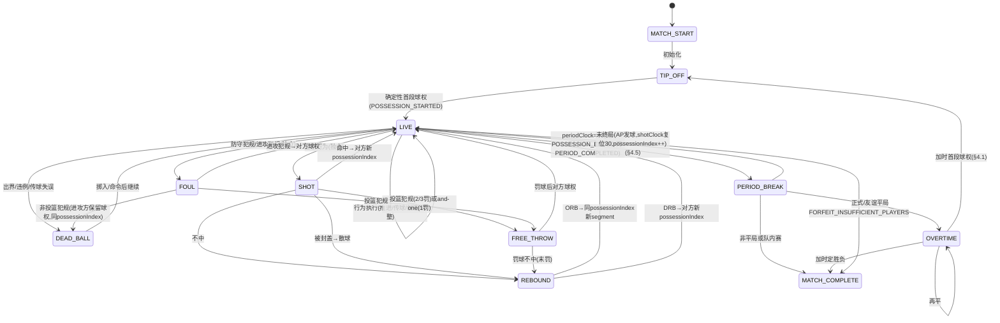

# 03 — Headless Model B 规范设计（Normative Design）

版本：v2.9 FINAL（**最终独立审核 READY FOR DEVELOPMENT 95/100**；v2.7 归一化 V27-01~V27-03、v2.8 复审 V28-01/V28-02 + 计数修正、V29 非阻塞清理已落地）
日期：2026-08-03
状态：见 §21（READY / NOT READY）

**修复记录**：本版针对十份独立审核逐项修复：首审（8 BLOCKING，v2.1）、v2.1 复审（R01-R05，v2.2）、v2.2 复审（V22-01~V22-05，v2.3）、v2.3 复审（V23-01~V23-04，v2.4）、v2.4 复审（V24-01~V24-04，v2.5）、v2.5 复审（V25-01~V25-04，v2.6）、v2.6 复审（V26-01~V26-04，v2.7）、v2.7 复审（V27-01~V27-03，v2.8）、v2.8 复审（V28-01 传球链残留、V28-02 BOXOUT actor、计数修正，v2.9），并吸收 `P02-003_Headless_Model_B_Design_v0.7_FINAL.zip` 规划。修复映射见 §21 与 `10`、`00b`。

基准规则：NCAA 女篮规则口径。实现权威 = 仓库 `packages/domain/src/match/**` 合同 + P02 基线 §12.4 + 开发计划 §7.4。

---

## 1. 概述与范围

P02-003 是"无干预 Headless Model B"解析器，在 P02-002 冻结合同上实现有效值、行为选择、球权/片段 resolver、统计归因、中性测试轮换、最小对手策略、session/finalize/replay/invariants。

**不实现**：玩家卡牌、暂停交互、关键时刻操作、生产 UI、2D、LLM/Agent、产品级助教轮换（P02-006）、完整执教命令（P02-009）、徽章获取/升级/槽位/传承、招募/成长/运营。

**读法**：所有数值为千分位定点整数；`[FROZEN]`=合同/基线冻结，`[DESIGN]`=本设计决策，`[CALIBRATE]`=初值需场景校准。

---

## 2. 单位、定点与 RNG（合同权威）

### 2.1 时间
- 每节 `regularPeriodSeconds=600`；加时 `overtimePeriodSeconds=300`；`foulOutLimit=5`（合同 `MatchRulesSchema`）。
- 1 显示秒 = 10 模拟秒；活球片段 ≥1s（开发计划 §7.4）。

### 2.2 定点（合同 `core/fixed-point.ts`）
- `FIXED_POINT_SCALE=1000`；安全整数千分位；`roundHalfUp` half-away-from-zero；clamp；溢出拒绝。
- 概率/执行值为瞬时计算量，不直接写入存档；结果事件与持久数值才进入 hash（基线 §15.3）。

### 2.3 keyed RNG（合同 `match/keyed-rng.ts` + 开发计划 §4.5）
```
MatchDrawKey = { matchSeed, period, possessionIndex, segmentIndex, drawKind, localIndex }
```
- 无可变 cursor；不同 drawKind 互不移位；命令/UI/cosmetic 不调用结果 draw。
- **完整 RNG Registry（含 localIndex 注册规则）见 `05` §H（修复 B-B02/T-B02）**。

### 2.4 身份链（合同 `schemas.ts`）
`eventId/factId/matchResultId` 派生见 `08`。Anchor/transcript 哈希链、local revision +1、cursor 稠密。

---

## 3. 比赛时间与状态推进

### 3.1 结构
- 正式/友谊：4×600s；平局加时 5 分钟直到分出胜负。
- 队内赛：4×600s；允许平局。
- 加时：重新确定首段球权（§4.1）。

### 3.2 片段推进
- `stepMatch` 每次从当前 Anchor 推进到下一合法控制边界（MATCH_START/DEAD_BALL/PERIOD_BREAK/MATCH_COMPLETE）。
- 片段内固定顺序（基线 §12.2）：读取阵容/职责/战术/疲劳/默契 → 节奏产生回合时长 → 选持球者 → 失误判定 → 行为选择 → 执行 → 犯规/投篮 → 篮板 → 归因 → 提交 Anchor。

---

## 4. 球权模型

### 4.1 首段球权（修复 B-B05：冻结唯一规则）
**决策（Owner 已确认）**：开场与每次加时的首段球权由 `matchSeed` **确定性派生**，不跳球、不随机：
```
首段球权 = keyedDrawUnitInterval({
  matchSeed, period, possessionIndex: 0, segmentIndex: 0,
  drawKind: 'BALL_HANDLER', localIndex: 0
}) < 0.5  → 主队先球；否则 客队先球
```
- 加时以 `period`（如 5、6…）重新判定。
- 用合同现有 `BALL_HANDLER` drawKind + `POSSESSION_STARTED` 事件表达，无新增事件/字段。
- 同 seed + 同坐标 → 同一首段球权；`step/runToEnd/replay` 一致。

### 4.2 球权流转（F-21）
得分后发球 / DRB / ORB / 抢断 / 传球成败 / 盖帽落点或出界 / 犯规与罚球自然流转，以合同 `POSSESSION_STARTED/POSSESSION_ENDED` 表达。

### 4.3 possessionIndex / segmentIndex 规范语义（修复 B-B04：统一）

| 字段 | 语义 | 递增条件 |
|---|---|---|
| `possessionIndex` | 统计球权序号 | **球权归属改变时 +1**（得分后、DRB、抢断、失误、违例、犯规转换球权） |
| `segmentIndex` | 同一统计球权内的进攻机会片段序号 | **同一球权内每次新的进攻机会 +1**：同方死球继续持球（非投篮犯规、出界保留）**以及进攻篮板后的再次进攻**（基线 §12.2 原文："进攻篮板后的再次进攻仍属于同一 possessionIndex，但进入新的 segmentIndex"） |

- **ORB 后**：`possessionIndex` 不变，`segmentIndex +1`（活球继续，但仍是一次新的进攻机会片段）。
- **同方死球后**（非投篮犯规、出界保留球权）：`possessionIndex` 不变，`segmentIndex +1`。
- **球权变更**：`possessionIndex +1`，`segmentIndex` 重置 0。
- 每个会抽取新比赛结果的活球片段至少消耗 1 秒（F-36）。

### 4.4 进攻时钟 shotClock（修复 B-B03：跨边界可重放）

**决策（方案 A，Owner 已确认）**：30s 进攻时钟。`shotClock` 不写入持久 Schema，**由已提交事件确定性重建**，保证 step/runToEnd/replay 一致。

**复位规则**：
| 事件 | shotClock 结果 |
|---|---|
| 球权变更（`POSSESSION_STARTED`/possessionIndex++） | 30s |
| 前场进攻篮板（`REBOUND(OFFENSIVE)`） | 20s |
| 盖帽散球/出界归对方 | 30s（新球权） |
| 非投篮犯规死球（同方保留球权） | **继承剩余时钟**（不重置） |
| 进攻时间违例 | 0 → 对方新球权 30s |

**重建算法**：`shotClock(anchor) = 30(或20/继承) − Σ(该球权内已提交 CLOCK_ADVANCED.seconds 自最近复位点起)`。
- 复位点由事件流确定：`POSSESSION_STARTED` → 30；`REBOUND(OFFENSIVE)` → 20；其他 carry 事件 → 继承。
- **事件前缀（修复 N03）**：重建必须使用 `events[0 : anchor.eventCursor]` 前缀（截至当前 Anchor 已提交的有序事件），**不是终场完整事件集**。
- `stepMatch` 提交片段时，在 draft 上按该前缀重算 shotClock；下一 Anchor 不含 shotClock 字段，重放时从同一前缀重建同一值。
- **同值测试要求（N03）**：同方死球、ORB、step/runToEnd/replay、日志开关关闭/开启 五条路径必须得到同一 shotClock。
- **违例**：`shotClock == 0` 活球 → `TURNOVER(UNFORCED_DEAD_BALL)` + EXPLANATION fact；对方球权，不记抢断（F-06b）。
- **临违例出手压力**：`shotClock ≤ 5s` 出手权重↑、仓促出手负修正（F-06c，[CALIBRATE]）。
- 节奏 `pace` 仍影响回合时长（慢×1.12/快×0.88），但受 30s 上界约束。

### 4.5 第 2、3、4 节首球权（修复 V22-04）

**决策（[DESIGN]，对齐 NCAA 交替拥有 + P02 基线 §12.2）**：

- **第 1 节**：开场首球权按 `03` §4.1（`BALL_HANDLER` keyed draw）确定；败者获得交替拥有（AP）箭头。
- **第 2、3、4 节**：由**交替拥有（AP）箭头**队发球；发球后箭头翻转（NCAA R12）。P02 无跳球事件，用 `POSSESSION_STARTED` 表达。
- **队内赛**：同一规则（蓝/白 6v6 同源，AP 同样适用）。

**每节开始的状态初始化（唯一规则）**：
| 项 | 规则 |
|---|---|
| 发球方 | AP 箭头队（第 2 节起）；开场用 §4.1 keyed draw |
| `possessionIndex` | **新球权，递增**（进入新节即新 possession） |
| `segmentIndex` | **重置为 0** |
| `POSSESSION_STARTED` 事件 | **每节生成一次**，side = AP 发球方 |
| `shotClock` | **复位到 30**（新球权，F-06a） |
| RNG 坐标 | `(period, possessionIndex, segmentIndex=0)` 作为该节首个 draw 坐标；首节沿用开场 §4.1 判定 |
| transcript 语义 | 节首 POSSESSION_STARTED 是一次 RULES/OPPONENT 决策条目（若无玩家命令） |

**禁止**：跨节继承上一节 Anchor 的 possession side 或剩余 shotClock（V22-04 明确）。

**节末事件顺序（N03）**：每节结束时**先生成 `POSSESSION_ENDED`（结束当前 possession）再生成 `PERIOD_COMPLETED`**，避免连续两个 `POSSESSION_STARTED`。下一节由 §4.5 AP 规则生成新 `POSSESSION_STARTED`。

**加时**：重新按 §4.1 keyed draw 判定首段球权（`03` §4.1 已冻结）。加时首球权规则与 FIBA AP 不同，为 Owner 确认的项目简化（N06，`01` §C 注明有意偏离）。

---

## 5. 完整状态机

### 5.1 状态
| 状态 | 说明 |
|---|---|
| `MATCH_START` | 开场：初始化 Anchor |
| `TIP_OFF`（首段球权） | 由 §4.1 确定性判定首段球权（无跳球事件；内部子状态） |
| `LIVE` | 活球片段循环：行为选择/执行 |
| `DEAD_BALL` | 死球边界：出界/犯规/违例后；开放换人与命令 |
| `SHOT` | 出手判定 |
| `REBOUND` | 篮板判定 |
| `FOUL` | 犯规判定（PERSONAL/SHOOTING/OFFENSIVE） |
| `FREE_THROW` | 罚球 |
| `PERIOD_BREAK` | 节间 |
| `OVERTIME` | 加时 |
| `MATCH_COMPLETE` | 终场（COMPLETED / FORFEIT_INSUFFICIENT_PLAYERS） |

### 5.2 Mermaid



---

## 6. 行为目录（单行为单判定修复 B-B01）

**核心原则（F-33~35 + V26-01）**：行为 RNG 分类以 `05` §C.10 为唯一权威——ONE_DRAW 行为一次 keyed RNG {成功/失败}，DETERMINISTIC 行为 0 次结果 RNG，犯规/失误/归因/机会质量 delta 是独立后续规则判定（各自 drawKind）。**并非所有行为消耗结果 RNG**（V26-01 反例 12）。创造类行为与终结/出手/传球是独立行为，不允许在行为内部隐藏多层随机链。

### 6.1 行为边界冻结（修复 B-B01/V22-01）

| 创造行为 | 一次 RNG 的结果集（唯一权威） | 成功后的场景修正 | 后续独立行为（新 RNG） |
|---|---|---|---|
| `DRIVE` 突破 | {成功（创造突破优势）/失败（被逼停）}；**丢球由独立 `TURNOVER_OCCURRENCE` 判定** | 突破优势 → 机会质量↑ | 后续 `LAYUP/CONTACTFIN`（终结）或 `HELDKICK`（传球） |
| `SHAKE` 晃人变向 | {成功（半步空间）/失败（被识破）} | 半步空间 → 机会质量↑ | 后续 `SPOTUP/PULLUP/THREE` |
| `ISO` 持球单打创造 | {成功（创造空间）/失败（被逼停）} | 空间 → 机会质量↑ | 后续 `PULLUP/MID` |
| `POSTUP` 背身要位 | {成功（背身优势）/失败（被顶住）} | 背身优势 → 机会质量↑ | 后续 `HOOK/CLOSE` |
| `STEP_BACK` 后撤步 | {成功（创造出手空间）/失败（被识破）} | 出手空间 → 机会质量↑ | 后续 `MID`（后撤步跳投，射区 MID_RANGE） |
| `HIGH_POST_CREATION` 高位组织 | {成功（弱侧空位）/失败（组织中断）} | 空位 → 机会质量↑ | 后续 `HPASS/SPOTUP` |
| `DRIVE→犯规` | 防守犯规在**独立** `DEFENSIVE_FOUL` drawKind 判定，不并入突破 | — | 独立罚球判定 |
| `ISO/POSTUP→进攻犯规` | 进攻犯规在**独立** `OFFENSIVE_FOUL` drawKind 判定 | — | 失球权 |

**关键（全文唯一权威，V22-01）**：
- **所有创造行为一次 RNG 只有 {成功/失败} 两结果**；**丢球不在此结果集内**——丢球由独立 `TURNOVER_OCCURRENCE` 判定（`05` §C.1）。与 `02` F-35a、`04` §B.1 一致。
- **属性分层**：STEP_BACK 创造核心 = ballHandling（不用 shooting）；POSTUP 创造核心 = ballHandling（不用 finishing）。shooting/finishing 只进入后续终结/出手的命中阶段（`05` §B/§C.8）。
- 突破**不包含**出手命中判定、犯规判定、助攻判定（这些是独立行为/判定）。
- `ISO` 是纯创造行为，**不直接命中**；出手由独立 `SHOT` 行为完成。
- `POSTUP` 是背身要位创造，**不直接终结**；勾手/近投由独立行为完成。
- 犯规（进攻/防守）都是独立判定（`OFFENSIVE_FOUL`/`DEFENSIVE_FOUL` drawKind），不藏在创造行为内部。
- **PULLUP 已定义为独立投篮行为**（`04` §B.2）：干拔（运球急停跳投），核心 shooting、射区 MID_RANGE、drawKind SHOOTER→SHOT（V22-02）。

### 6.2 行为→合同 drawKind/事件映射（修复 B-B02 的 drawKind 闭合）

| 行为 | drawKind | 事件 |
|---|---|---|
| 创造类（DRIVE/SHAKE/ISO/POSTUP/STEP_BACK/HIGH_POST_CREATION） | `BEHAVIOR`（创造结果） | `CLOCK_ADVANCED` + 机会质量 EXPLANATION fact |
| 持球者选择 | `BALL_HANDLER` | `POSSESSION_STARTED` |
| 出手者选择 | `SHOOTER` | — |
| 出手命中判定（含罚球） | `SHOT` | `SHOT`/`FREE_THROW` |
| 失误发生 | `TURNOVER_OCCURRENCE` | `TURNOVER` |
| 失误分类 | `TURNOVER_CLASSIFICATION` | `TURNOVER` |
| 防守动作（稳守/冒险） | `DEFENSIVE_ACTION` | — |
| 进攻犯规 | `OFFENSIVE_FOUL` | `FOUL(OFFENSIVE)` |
| 防守犯规 | `DEFENSIVE_FOUL` | `FOUL` |
| 篮板归属 | `REBOUND` | `REBOUND` |
| 抢断/封盖/助攻归因 | `STEAL_ATTRIBUTION`/`BLOCK_ATTRIBUTION`/`ASSIST_ATTRIBUTION` | `STEAL`/`BLOCK`/`ASSIST` |
| 片段时长 | `SEGMENT_DURATION` | `CLOCK_ADVANCED` |
| 转换/阵地 | `TRANSITION` | — |

**罚球命中判定 drawKind = `SHOT`**（罚球是投篮的一种；`localIndex` 递增区分第几罚）。完整 RNG Registry 见 `05` §H。

### 6.3 完整行为清单（修复 B-B08：补齐 Step Back / High Post / Creative Pass）

`04` 完整矩阵覆盖以下行为（含 v0.7 新增）：
- **持球创造**：ADV、REORG、DRIVE、SHAKE、ISO、STEP_BACK（后撤步，新）、POSTUP、HIGH_POST_CREATION（高位组织，新）
- **投篮终结**：SPOTUP、CATCHSHOT、THREE、MID、CLOSE、FLOATER、HOOK、LAYUP、CONTACTFIN、CONTESTEDFIN、FT
- **传球组织**：PASS、HPASS、CREATIVE_PASS（花式传球 FPASS，独立风险收益，新）、ASTOPP、PASSTOV、BALLDESTROY
- **无球关键结果**：SCREEN、CUT、HELDKICK、DOUBLECREATE、PUTBACK
- **防守**：ONDEF、PRESS、STLTRY、CONTEST、HELPD、DOUBLET、TRANSITIOND、FOUL（**BLK 为 ATTRIBUTION_ONLY，不参加 P_select**，`05` §C.10）
- **篮板**：ORB、DRB、BOXOUT、BLKLOOSE、出界

**CREATIVE_PASS（花式传球）风险收益合同**（修复 B-B08/反例 5）：
- 相对 `PASS`：机会质量收益 `+[CALIBRATE]`（弱侧/切入空位），失误概率增量 `+[CALIBRATE]`；
- 独立参数：`creativePassOpportunityBonus`、`creativePassTurnoverRisk`；
- 合法场景：进攻空间充裕、防守冒险压力低时；
- 公式见 `05` §C.7。

---

## 7. 属性体系与执行值

### 7.1 合同 10 能力 + bodyImpact（F-42~52）
`finishing/shooting/ballHandling/playmaking/perimeterDefense/interiorDefense/rebounding/athleticism/stamina/tacticalUnderstanding` + `bodyImpact`。全为 0-100 整数。

### 7.2 执行值组合（基线 §12.4，[CALIBRATE]）
见 `05` §B（护球组织/防守压力/区域攻防/创造/篮板/防守控制/抢断/封盖/助攻/自主创造）。

### 7.3 属性作用原则（F-58~62）
专项决定上限、身体/意识只作修正、身体/意识不替代专项、每执行组合内各属性只进入一次。

---

## 8. 倾向（合同 FIXED 6）

`possessionParticipation/passSelection/shotZones{三元=100}/transitionParticipation/defensiveRisk/offensiveRebounding`（F-63~68）。行为选择：`权重 = 倾向权重 × 战术倍率 × 场景可用性`（F-69）；倾向不直接改成功率（F-70）；过滤后权重 0 用固定安全行为（F-72）。

---

## 9. 状态：疲劳与默契（减法修正）

- 疲劳：`fatigueMilli` 千分位；执行惩罚 `clamp((疲劳-30)×0.20, 0, 14)`（F-75）；负荷按已提交时间片累计（F-78）。
- 默契：场上 C 职责加权（F-82）；`团队执行修正 = clamp((C-50)×0.12, -6, +6)`（F-84）；只作用于团队协作判定。
- 无其他动态状态。

---

## 10. 徽章接口 = 合同特质 + 完整接口（F-89~98，G10）

- 合同 `archetypeTrait`（6 特质 +6 执行点）为 P02 期最小载体。
- 完整 `Badge` 接口（含 select/success）**仅保留设计形态，不进入 schema 落实**（G10，Owner 已决策）。

---

## 11. 三轴战术与 effect

三轴（节奏/进攻重心/防守重心）+ 8 effect 参数 + ADD ±6000 milli / MULTIPLY 750-1250。单轴单次判定净修正上限 ±6。见 `05`。

---

## 12. 最小确定性对手策略

对手 = 引擎默认实例（INSTANT）；固定首发、中性测试轮换（`internal/test`）、基础战术档案；节间按比分/疲劳/玩家防守重心调节奏/权重；写原因码 + OPPONENT_POLICY effect；无 DDA。

---

## 13. 中性测试轮换（internal/test）

死球/节间/犯满触发；疲劳替换 + 位置有效性；确定性；标记 `internal/test`（F-123）。

---

## 14. 犯规离场与少人继续

5 犯离场；4/3/2 人继续（传球池缩小、疲劳上升、防守折扣 [CALIBRATE]）；<2 人 `FORFEIT_INSUFFICIENT_PLAYERS`（合同 anchor status）。

---

## 15. 概率与判定框架

执行值差式 + 固定顺序（能力组合 → −疲劳 → ±位置错配 → ±特质 → ±战术±6 → 关键公式 → clamp → rng）。完整公式见 `05`。

---

## 16. 事件、事实与统计

- 合同 16 事件闭合；16 drawKind 闭合。
- **创建机会 Fact 字段级合同见 `06` §D（修复 B-B07/E-B02）**。
- **团队篮板/团队失误合同决定见 `09` G4/G5 与 `06` §E（修复 B-B06/E-B01）**。
- 成功传球因果链（传球者/接球者/行为标识）见 `06` §F（修复 E-B03）。
- box score = 合同 `PlayerBoxScoreSchema`；统计由事件 reducer 累积（F-135）。

---

## 17. P02-002 Traceability 摘要

完整矩阵 `08`。

---

## 18. 最小合同增补摘要（`09`）

- G1 shotClock：方案 A，事件重建，**不改 Schema**（已决策）。
- G4/G5 团队篮板/团队失误：**已决策选项 2 简化口径（无几何依赖）**，不改 Schema（修复 B-B06）。
- G9 创建机会 Fact：**字段级合同在 `06`，容器已含（MatchFact），无新事件**（修复 B-B07）。
- G10 徽章接口：仅接口与设计（已决策）。
- G7 加时：合同已含 300s，确认。

---

## 19. 星级与真实性校准目标

P02 只有 3★/4★。方向场景 = 开发计划 §7.4 5+1（`07`）。**新增消融与多核心场景见 `07` §A7/A8（Non-Blocking 1/2）**。

---

## 20. 性能预算

10,000 场 ≤60,000ms、p95 ≤10ms、RSS ≤512MiB（F-150~152）。

---

## 21. READY 判定

### 审核修复映射（v2.1 → v2.2）

**前轮 B-B01~B-B08（v2.1 关闭，历史保留）**：
| 审核 BLOCKING | 修复位置 | 状态 |
|---|---|---|
| B-B01 单行为单判定/复合行为链 | `03` §6.1 行为边界冻结 + `04` §B | ✅ |
| B-B02 RNG 注册不闭合 | `05` §H RNG Registry | ✅ |
| B-B03 shotClock 跨边界恢复 | `03` §4.4 事件重建算法 | ✅ |
| B-B04 ORB/segment 语义冲突 | `03` §4.3 统一语义 | ✅ |
| B-B05 首段球权未冻结 | `03` §4.1 确定性 keyed draw | ✅ |
| B-B06 球队篮板/失误合同 | `09` G4 + `06` §E（选项 2 简化口径） | ✅ |
| B-B07 创建机会 Fact 字段合同 | `06` §D | ✅ |
| B-B08 Step Back/High Post/Creative Pass | `04` §B + `05` §C.7 | ✅ |

**v2.1 复审 R01-R05（v2.2 关闭）**：
| 复审 BLOCKING | 修复位置 | 状态 |
|---|---|---|
| R01 行为选择/创造结果合同不完整 | `05` §C.8 创造结果概率 + §D.2 行为族→倾向全量映射 | ✅ |
| R02 shooting/finishing 创造与执行层重复增强 | `05` §B 创造执行族（STEP_BACK 不用 shooting、POSTUP 不用 finishing） | ✅ |
| R03 localIndex 受分支调用数影响 | `05` §H 固定语义 ordinal 分区 | ✅ |
| R04 Creative Pass 助攻因果链冲突 | `06` §F.1 唯一链 + `04` §B.3 | ✅ |
| R05 G4 团队事件口径全文不一致 | `04` §B.6 分来源出界表 + `06` §E + `09`/`11`/`10` 一致化 | ✅ |

**v2.1 Non-Blocking（N01-N06，v2.2 修复）**：possessionHHI 数据源（`07` §A8 PossessionHandlerFact）、多核心预期降级（N02）、shotClock 事件前缀（N03，`03` §4.4）、首段 ordinal（N04，`05` §H.2）、全文状态统一（N05）、[CALIBRATE] 边界（N06，`05` §I）。

**v2.2 复审 V22-01~V22-05（v2.3 关闭）**：
| 复审 BLOCKING | 修复位置 | 状态 |
|---|---|---|
| V22-01 创造行为权威合同互相冲突 | `02` F-35a / `03` §6.1 / `04` §B.1 / `05` §C.8 结果集与属性全文统一 | ✅ |
| V22-02 行为图不完整（PULLUP/多出口/全量/复合倾向） | `05` §D.4 selectable vs 结果分类 + §D.5 多出口选择 + 复合倾向相乘 + `04` §B.2 PULLUP | ✅ |
| V22-03 HIGH_POST 成功率方向错误 | `05` §C.8 改为 vs 对方协防执行 + 单调性反例 | ✅ |
| V22-04 第 2~4 节首球权/shotClock 复位缺失 | `03` §4.5 AP 发球/坐标/POSSESSION_STARTED/shotClock=30 | ✅ |
| V22-05 盖帽后出界球权归属冲突 | `04` §B.6 / `06` §E / `09` G4/G5 分来源出界表 | ✅ |

**v2.2 Non-Blocking（N1-N7，v2.3 修复）**：PossessionHandlerFact 拼写/字段（N1/N2）、CreationFact sourceEventIds 去重（N3）、09 G4/G5 术语统一（N4）、00 冲突 #9 状态（N5）、10 引用报告（N6）、Owner Checklist 普通项未勾（N7）。

**v2.3 复审 V23-01~V23-04（v2.4 关闭）**：
| 复审 BLOCKING | 修复位置 | 状态 |
|---|---|---|
| V23-01 盖帽出界球权规则反向 | `04` §B.6 / `06` §E / `09` G4/G5 按 FIBA 23.2.1（防守者盖出界→进攻方继续） | ✅ |
| V23-02 Behavior Registry 不闭合 | `05` §D.2 canonical registry（当时 44=38+6；**V28 计数修正为 44=34+10**）+ §D.4 多出口按权重 + §D.5 HELDKICK=passSelection + `04` §B | ✅ |
| V23-03 关键无球/协防行为无执行概率 | `05` §C.9（SCREEN/CUT/HELDKICK/DOUBLECREATE/HELPD/DOUBLET/PRESS/STLTRY/CONTEST/BLK）+ `04` §B.4/B.5 | ✅ |
| V23-04 receiver/beneficiary 选择缺失 | `05` §H.2（BALL_HANDLER 2000..2999）+ `06` §F.2（候选/权重/排序/回退） | ✅ |

**v2.3 Non-Blocking（N01-N06，v2.4 修复）**：PossessionHandlerFact 层级（N01，`07` §A8）、09 G9 sourceEventIds 残留（N02）、节末 POSSESSION_ENDED（N03，`03` §4.5）、00 版本统一（N04）、行为计数改引用 registry（N05）、加时首球权偏离声明（N06，`01` §C1）。

**v2.4 复审 V24-01~V24-04（v2.5 修复，部分被 v2.5 复审复核为仍需深化）**：
| 复审 BLOCKING | v2.5 修复位置 | 状态（v2.5 复审） |
|---|---|---|
| V24-01 RNG 语义槽复用 | `05` §H.2 分离选择/创造/off-ball 执行、防守模式/执行 | 大区间分离 ✅；实例 ordinal 与行为 draw 冲突 → 转 V25-04 |
| V24-02 能力充当倾向 + 缺参与者列 | `05` §D.2 清除能力倾向 + §D.6 trigger/actor/opponent | 能力倾向已清 ✅；倾向归属（handler vs actor）→ 转 V25-02 |
| V24-03 执行结果不唯一 | `05` §C.9 补数值 + 次级分支 + STLTRY 链化 | 公式增加 ✅；与 F-33/F-35、犯规/封盖链冲突 → 转 V25-01/V25-02 |
| V24-04 参与者身份与传球转移 | `06` §F.2 receiver 权威化 + §F.3 actor 选择 | receiver 权威化 ✅；actor ordinal/双人/空回退 → 转 V25-04 |

**v2.5 复审 V25-01~V25-04（v2.6 关闭）**：
| 复审 BLOCKING | 修复位置 | 状态 |
|---|---|---|
| V25-01 行为 RNG 次数分类 | `05` §C.10（DETERMINISTIC/ONE_DRAW 唯一分类）+ `02` F-33/F-35/F-35b 修订 | ✅ |
| V25-02 BLK/DOUBLET/CONTEST/STLTRY 顺序 | `05` §C.9 BLK 移出（missed SHOT 后归因）、DOUBLET 犯规用 DEFENSIVE_FOUL、STLTRY/CONTEST 不消耗执行 draw | ✅ |
| V25-03 机会质量 delta 语义 | `05` §C.9 raw→effective(±6)→求和→clamp；Fact 记录 effective | ✅ |
| V25-04 actor ordinal/双人/空回退 | `05` §D.6/H.2 ordinal 绑定选择实例、DOUBLET 确定性 top-2、空候选=行为不可用 | ✅ |

**v2.5 Non-Blocking（N1-N6，v2.6 修复）**：03 §21 V24 关闭声明修正（N1）、版本统一 v2.6（N2）、C.9 覆盖声明（N3）、bodyImpact 边界（N4）、加时偏离（N5）、[CALIBRATE] 边界（N6）。

**v2.6 复审 V26-01~V26-04（v2.7 关闭）**：
| 复审 BLOCKING | 修复位置 | 状态 |
|---|---|---|
| V26-01 行为分类与概率链不唯一 | `05` §C.10 唯一 4 类分类（BLK→ATTRIBUTION_ONLY、当时 selectable 37；**V28 计数修正为 34**）+ PASS/CREATIVE_PASS/HELDKICK 唯一链 + `03`/`04` 删"所有行为一次 RNG" | ✅ |
| V26-02 防守行为选择与 actor ordinal | `05` §D.7 防守行为选择（BEHAVIOR 0..999）+ actor ordinal 绑定选择实例 + DOUBLET 聚合=较高者 | ✅ |
| V26-03 机会质量 delta 数学 | `05` §C.9 四层公式（raw/perEvent±6/net±6/final）+ C.7/C.8 BONUS 为 raw + `06` §D Fact 记 perEventEffective | ✅ |
| V26-04 后续判定 localIndex | `05` §H.2/H.6 foul/turnover/defense 绑定行为实例（5000+sel / 4000+sel / 2000+sel / 1000+sel） | ✅ |

**v2.6 Non-Blocking（N1-N5，v2.7 修复）**：07/08 版本标注（N1）、delta 编码比例（N2，`06` §D）、03 §21 关闭声明（N3）、行为时间与 SEGMENT_DURATION（N4，`05` §H.1）、[CALIBRATE] 边界（N5）。

**v2.7 复审 V27-01~V27-03（v2.8 归一化）**：
| 复审 BLOCKING | 修复位置 | 状态 |
|---|---|---|
| V27-01 唯一 44 行分类表 | `05` §C.10 真正 44 行（含 PASSTOV/BALLDESTROY/FOUL/BLKLOOSE）+ ORB/DRB/BOXOUT→RULE_RESULT + §D.2 同步 | ✅ |
| V27-02 唯一 PASS 失败链 | `05` §C.10/C.9 + `04` §B.3 单 draw TURNOVER_OCCURRENCE | ✅ |
| V27-03 04 Event 对齐 05 | `04` §B.5 引用唯一 resolver 链（STLTRY/HELPD/DOUBLET/FOUL） | ✅ |

**v2.8 复审 V28-01~V28-02 + 计数修正（v2.9 修复）**：
| 复审 BLOCKING / 错误 | 修复位置 | 状态 |
|---|---|---|
| V28-01 传球链残留（C.9 HELDKICK 双阶段 / H.2 off-ball / H.3 HPASS·ASTOPP deterministic） | `05` §C.9 HELDKICK→单 draw TURNOVER_OCCURRENCE；§H.2 移出 HELDKICK；§H.3 移出 HPASS/ASTOPP | ✅ |
| V28-02 BOXOUT actor 合同缺失（RULE_RESULT 无 selection ordinal） | `05` §D.6/D.7/H.2/C.10 + `06` §F.3 + `04` §B.6：boxer 由 REBOUND 规则确定性派生（无独立 draw） | ✅ |
| 计数错误（声明 33+11，实际 34+10） | `05` §D.2/C.10、`04` §D、`00b`、`03` 计数修正为 34 selectable + 10 non-selectable | ✅ |

### 阻塞项
1. ~~G4/G5 团队篮板/团队失误~~ — **已决策：选项 2 简化口径（无几何依赖）**，全文唯一（V23-01 覆盖盖帽出界）。
2. ~~G10 徽章接口~~ — 仅接口与设计，不落实（已决策，无阻塞）。

其余项全部 PASS。**v2.6 复审 4 项 BLOCKING 全部关闭，可重新提交独立复审**。
